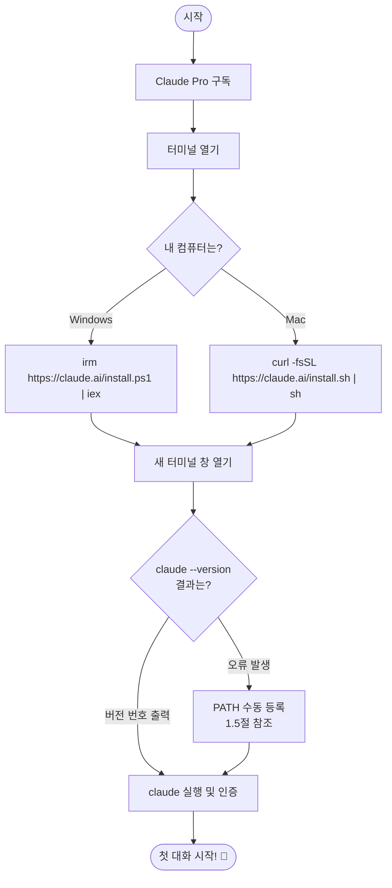

# 챕터 1: Claude Code, 처음 만나기 — 설치부터 첫 대화까지

## 이 챕터에서 배울 것

이 챕터를 끝까지 읽고 따라 하면, 여러분은 AI와 함께 코드를 작성할 수 있는 도구를 컴퓨터에 설치하고, 처음으로 AI에게 "파일 하나 만들어줘"라고 부탁해서 실제로 파일이 만들어지는 장면을 직접 보게 됩니다.

코딩을 전혀 몰라도 괜찮습니다. 설치 과정에서 모르는 단어가 나와도 괜찮습니다. 이 챕터는 Windows와 Mac 모두 처음부터 설명합니다.

---

## 1.1 Claude Code가 뭔가요?

여러분은 아마 ChatGPT나 Claude.ai를 써보셨을 거예요. 브라우저에서 접속해서 질문하면 답을 해주는 그 도구들이요.

Claude Code는 조금 다릅니다.

ChatGPT나 Claude.ai는 **대화 창** 안에서만 동작합니다. AI가 코드를 짜줘도, 그 코드를 직접 여러분 컴퓨터 파일에 저장해주지는 않아요. 복사해서 붙여넣기를 직접 해야 하죠.

Claude Code는 **여러분의 컴퓨터 안에서** 동작합니다. AI에게 "이 파일을 수정해줘"라고 하면, 실제로 그 파일이 수정됩니다. "새 폴더 만들고 거기에 코드 파일 3개 만들어줘"라고 하면, 정말로 그렇게 됩니다.

한마디로: **AI가 여러분 컴퓨터의 파일과 코드를 직접 다룰 수 있게 해주는 도구**입니다.

> **비유하자면:** ChatGPT는 전화로 요리 레시피를 알려주는 요리사예요. Claude Code는 우리 집 부엌에 직접 와서 요리를 해주는 요리사입니다.

*ChatGPT·Claude.ai와 Claude Code의 핵심 차이*

|  | ChatGPT / Claude.ai | Claude Code |
|--|---------------------|-------------|
| **어디서 동작하나요?** | 브라우저(인터넷) 안 | 내 컴퓨터 안 |
| **파일을 직접 저장해주나요?** | ❌ 직접 복붙해야 함 | ✅ AI가 직접 저장 |
| **어떻게 사용하나요?** | 웹사이트 접속 | 터미널 명령어 |
| **가장 잘 맞는 상황** | 질문하고 답 받기 | 파일·코드 작업하기 |

---

## 1.2 터미널, 겁내지 마세요

Claude Code를 설치하려면 **터미널**이라는 것을 써야 합니다. 처음 보면 까만 화면에 글자만 있어서 무섭게 느껴질 수 있어요.

터미널은 그냥 **컴퓨터에게 명령을 텍스트로 내리는 창**입니다. 마우스로 아이콘을 더블클릭하는 대신, 글자로 명령을 입력하는 방식이에요.

예를 들어 바탕화면에 폴더를 만들 때 마우스 오른쪽 클릭 → 새 폴더를 만드는 대신, 터미널에서 `mkdir 새폴더` 라고 입력하면 됩니다.

처음엔 낯설지만, 이 챕터에서 입력할 명령어는 많지 않습니다. 하나씩 따라 하다 보면 어느새 익숙해질 거예요.

*터미널은 내가 입력한 명령을 컴퓨터에 전달하는 통로입니다*

```
  나  ──── 텍스트 명령 입력 ────▶  터미널  ────▶  컴퓨터
            "mkdir 새폴더"                         (폴더 생성)
       ◀──────────── 결과 출력 ────────────────────
                   "생성 완료"
```

---

### 실습 1-1: 터미널 열기

**Windows 사용자**

이 챕터에서는 **Windows PowerShell**을 사용합니다. 관리자 권한 없이 일반 실행으로 충분합니다.

방법 A — 시작 메뉴 이용:

Step 1: 화면 왼쪽 아래의 **시작 버튼(Windows 로고)** 을 클릭하세요.

Step 2: 검색창에 `powershell` 이라고 입력하세요.

Step 3: 검색 결과에서 **Windows PowerShell** 을 클릭하세요.

> "Windows PowerShell"과 "PowerShell 7" 모두 사용 가능합니다.

방법 B — 단축키 이용 (더 빠름):

Step 1: 키보드에서 **Windows 키 + R** 을 동시에 누르세요.

Step 2: 작은 창이 뜨면 `powershell` 이라고 입력하고 **확인** 을 클릭하세요.

이렇게 나오면 성공!
```
Windows PowerShell
Copyright (C) Microsoft Corporation. All rights reserved.

PS C:\Users\여러분이름>
```
파란색(또는 검은색) 창이 뜨고 `PS C:\Users\...>` 같은 글자가 보이면 성공입니다.

---

**Mac 사용자**

이 챕터에서는 **터미널(Terminal)** 앱을 사용합니다. Mac에 기본으로 설치되어 있습니다.

방법 A — Spotlight 이용 (가장 빠름):

Step 1: 키보드에서 **Command(⌘) + Space** 를 동시에 누르세요.

Step 2: 검색창에 `터미널` 또는 `terminal` 이라고 입력하세요.

Step 3: **터미널** 앱을 클릭하세요.

방법 B — Finder 이용:

Step 1: **Finder** 를 열고 상단 메뉴에서 **이동 → 유틸리티** 를 클릭하세요.

Step 2: **터미널** 앱을 더블클릭하세요.

이렇게 나오면 성공!
```
사용자명@컴퓨터이름 ~ %
```
흰색(또는 검은색) 창이 뜨고 `%` 기호가 깜빡이면 성공입니다.

---

스스로 해보기: 터미널에 `echo 안녕하세요` 라고 입력하고 Enter를 눌러보세요. 화면에 `안녕하세요`가 출력되면 첫 명령어 실행 성공입니다!

---

## 1.3 Claude Pro 구독 준비하기

Claude Code를 설치하기 전에 반드시 알아야 할 것이 있습니다.

**Claude Code는 무료로 사용할 수 없습니다.** Claude.ai의 무료 계정으로는 Claude Code를 실행할 수 없어요. 반드시 유료 구독이 필요합니다.

| 요금제 | 가격 | Claude Code 사용 |
|--------|------|-----------------|
| 무료 | $0 | ❌ 사용 불가 |
| **Pro** | **$17/월** | **✅ 사용 가능** |
| Max | $100/월~ | ✅ 사용 가능 |

이 챕터에서는 **Claude Pro ($17/월)** 구독을 기준으로 설명합니다. Windows와 Mac 모두 동일하게 진행합니다.

---

### 실습 1-2: Claude Pro 구독하기

**Step 1: claude.ai 접속**

브라우저 주소창에 `claude.ai` 를 입력하고 Enter를 누르세요.

**Step 2: 로그인**

[Google로 계속하기] 버튼을 클릭하거나, 이메일 주소로 로그인하세요.

**Step 3: Pro 구독 시작**

로그인 후, 화면 왼쪽 하단에서 **[요금제 업그레이드]** 를 클릭하세요.

요금제 선택 화면에서 **Pro ($17)** 의 **[Claude 사용해 보기]** 버튼을 클릭하고 결제를 완료하세요.

**Step 4: Pro 구독 확인**

결제 후 화면 왼쪽 하단에 이름 아래 **"Pro 요금제"** 배지가 표시되면 성공입니다.

> **주의:** Pro 배지가 확인되면 다음 단계로 이동하세요. Claude Code는 무료 티어가 없으므로 반드시 이 단계를 완료해야 합니다.

---

## 1.4 Claude Code 설치하기

Pro 구독이 준비되었다면 Claude Code 설치는 딱 한 줄입니다. Windows와 Mac의 명령어만 다르고, 나머지 과정은 동일합니다.

*챕터 1 전체 설치 흐름 — 본인 상황에 맞는 경로를 따라가세요*



---

### 실습 1-3: Claude Code 설치

**Windows 사용자**

Step 1: PowerShell을 열고 아래 명령어를 **마우스 오른쪽 클릭** 또는 **Ctrl+V** 로 붙여넣고 Enter를 누르세요:

```
irm https://claude.ai/install.ps1 | iex
```

> `irm`은 설치 스크립트를 내려받고, `iex`는 그것을 즉시 실행합니다. Node.js나 다른 도구를 별도로 설치할 필요가 없습니다.

이렇게 나오면 성공!
```
Setting up Claude Code...
✓ Claude Code successfully installed!

  Version: 2.1.160
  Location: C:\Users\사용자명\.local\bin\claude.exe

✅ Installation complete!
```

Step 2: PowerShell 창을 **완전히 닫고 새로 열어서** 아래를 입력하세요:

```
claude --version
```

이렇게 나오면 완벽합니다:
```
2.1.160 (Claude Code)
```

> 버전 번호가 나오면 **1.6절**로 바로 넘어가세요. 오류가 나면 1.5절을 참고하세요.

---

**Mac 사용자**

Step 1: 터미널을 열고 아래 명령어를 붙여넣고 Enter를 누르세요:

```
curl -fsSL https://claude.ai/install.sh | sh
```

> `curl`은 설치 스크립트를 내려받고, `sh`는 그것을 즉시 실행합니다. Node.js나 다른 도구를 별도로 설치할 필요가 없습니다. Apple Silicon(M1/M2/M3)과 Intel Mac 모두 자동으로 맞는 버전이 설치됩니다.

이렇게 나오면 성공!
```
Setting up Claude Code...
✓ Claude Code successfully installed!

  Version: 2.1.160
  Location: /Users/사용자명/.local/bin/claude

✅ Installation complete!
```

Step 2: 터미널 창을 **완전히 닫고 새로 열어서** 아래를 입력하세요:

```
claude --version
```

이렇게 나오면 완벽합니다:
```
2.1.160 (Claude Code)
```

> 버전 번호가 나오면 **1.6절**로 바로 넘어가세요. 오류가 나면 1.5절을 참고하세요.

---

> **왜 새 창이 필요한가요?** 설치 후 프로그램 경로(PATH)가 새 창에서만 인식됩니다. 같은 창에서는 설치 결과가 반영되지 않을 수 있어요. Windows와 Mac 모두 동일합니다.

---

## 1.5 PATH 문제 해결 (오류가 난 경우만)

`claude --version` 을 입력했을 때 아래와 같은 오류가 나온 경우에만 이 절을 따라 하세요.

**Windows 오류 메시지:**
```
'claude' 용어가 cmdlet, 함수, 스크립트 파일 이름으로 인식되지 않습니다.
```

**Mac 오류 메시지:**
```
zsh: command not found: claude
```

이 오류는 설치는 완료됐지만 컴퓨터가 `claude` 명령어의 위치를 모르는 상태입니다. **PATH 등록**으로 쉽게 해결할 수 있어요.

---

### Windows — PATH 해결

두 가지 방법 중 편한 것을 선택하세요.

**방법 A — 명령어로 해결 (더 빠름)**

PowerShell에 아래 명령어를 붙여넣고 Enter를 누르세요. 경고 팝업이 뜨면 **[붙여넣기]** 를 클릭하세요.

1번 명령어 — 영구 등록:
```powershell
$binPath = "$env:USERPROFILE\.local\bin"
$userPath = [Environment]::GetEnvironmentVariable("Path","User")
if ($userPath -notlike "*$binPath*") {
    [Environment]::SetEnvironmentVariable("Path","$userPath;$binPath","User") }
```

2번 명령어 — 지금 창에 즉시 적용:
```powershell
$env:Path = [Environment]::GetEnvironmentVariable("Path","Machine") + ";" + [Environment]::GetEnvironmentVariable("Path","User")
```

완료 후 `claude --version` 을 입력해서 버전 번호가 나오면 해결된 것입니다.

**방법 B — 화면으로 해결 (명령어가 어렵다면)**

Step 1: **Windows 키 + R** 을 누르고 `sysdm.cpl` 입력 후 **확인**

Step 2: **[고급]** 탭 클릭 → **[환경 변수]** 버튼 클릭

Step 3: 위쪽 "사용자 변수" 영역에서 **Path** 를 선택 → **[편집]** 클릭

Step 4: **[새로 만들기]** 클릭 후 아래 경로 입력:
```
%USERPROFILE%\.local\bin
```

Step 5: **확인 → 확인** 클릭 후 PowerShell을 새로 열고 `claude --version` 확인

---

### Mac — PATH 해결

Mac은 쉘(Shell) 종류에 따라 설정 파일이 다릅니다. 아래 명령어로 먼저 확인하세요:

```bash
echo $SHELL
```

- `/bin/zsh` 가 나오면 → **Zsh** 사용 중 (macOS Catalina 이후 기본값)
- `/bin/bash` 가 나오면 → **Bash** 사용 중

**Zsh 사용자 (대부분의 Mac)**

터미널에 아래 명령어를 입력하세요:

```bash
echo 'export PATH="$HOME/.local/bin:$PATH"' >> ~/.zshrc
source ~/.zshrc
```

**Bash 사용자**

터미널에 아래 명령어를 입력하세요:

```bash
echo 'export PATH="$HOME/.local/bin:$PATH"' >> ~/.bash_profile
source ~/.bash_profile
```

완료 후 `claude --version` 을 입력해서 버전 번호가 나오면 해결된 것입니다.

---

## 1.6 처음 실행하기 — 로그인 과정

설치와 PATH 확인이 완료되었으면 이제 Claude Code를 실행하고 로그인합니다. Windows와 Mac의 로그인 과정은 동일합니다.

---

### 실습 1-4: Claude Code 첫 실행 및 로그인

**Step 1: 작업 폴더로 이동**

먼저 Claude Code를 사용할 폴더로 이동합니다. 바탕화면을 작업 공간으로 쓰겠습니다.

Windows:
```
cd Desktop
```

Mac:
```
cd ~/Desktop
```

**Step 2: Claude Code 실행**

```
claude
```

처음 실행하면 픽셀 캐릭터와 함께 로그인 선택 화면이 나타납니다.

**Step 3: 로그인 방식 선택**

```
Select login method:
> 1. Claude account with subscription · Pro, Max, Team, or Enterprise
  2. Anthropic Console account · API usage billing
  3. 3rd-party platform · Amazon Bedrock, Microsoft Foundry, or Vertex AI
```

**1번을 선택하고 Enter** 를 누르세요. (Pro 구독 계정으로 로그인하는 방식입니다)

**Step 4: 브라우저 승인**

브라우저가 자동으로 열리고 Claude Code 연결 승인 화면이 나타납니다. **[승인]** 버튼을 클릭하세요.

> **브라우저가 자동으로 열리지 않는다면:** 터미널에 표시된 URL을 복사(c 키 입력)해서 브라우저 주소창에 직접 붙여넣으세요.

**Step 5: 폴더 신뢰 확인**

터미널로 돌아오면 아래와 같은 질문이 나옵니다:

```
Quick safety check: Is this a project you created or one you trust?
> 1. Yes, I trust this folder
  2. No, exit
```

**1번을 선택하고 Enter** 를 누르세요.

**이렇게 나오면 성공!**
```
Logged in as 여러분@email.com
Login successful. Press Enter to continue...
```

Enter를 누르면 Claude Code 메인 화면으로 진입합니다. `>` 프롬프트가 깜빡이면 대화 준비 완료입니다!

---

## 1.7 첫 번째 대화 — "파일 하나 만들어줘"

이제 진짜 첫 대화를 해볼 시간입니다.

Claude Code는 자연어로 대화합니다. "파일 만들어줘"처럼 평소 말하듯이 입력하면 됩니다. 특별한 명령어를 외울 필요가 없어요. Windows와 Mac 모두 동일하게 사용합니다.

---

### 실습 1-5: AI에게 파일 만들어달라고 해보기

`>` 프롬프트 뒤에 아래와 같이 입력하고 Enter를 누르세요:

```
hello.txt 파일을 만들고 안에 "안녕하세요, Claude Code입니다!"라고 써줘
```

Claude Code가 응답하면서 파일을 만들 것입니다:

```
I'll create the hello.txt file for you.

● Write(hello.txt)
  ⎿ 안녕하세요, Claude Code입니다!

✓ Done
```

*Claude Code가 바탕화면에 만들어준 파일 위치*

```
바탕화면/
├── hello.txt   ← ✅ Claude Code가 방금 만든 파일
└── (기존 파일들)
```

이제 바탕화면으로 가서 `hello.txt` 파일을 확인해보세요. 파일을 열면 "안녕하세요, Claude Code입니다!"가 적혀 있을 거예요.

**AI가 여러분 컴퓨터에 처음으로 파일을 만들어줬습니다.**

스스로 해보기:
```
memo.txt 파일을 만들고, 오늘 날짜와 "Claude Code 첫 실습 완료"라고 써줘
```

Claude Code 종료는 `/exit` 를 입력하거나 **Ctrl + C** 를 누르세요.

---

## 이 챕터에서 배운 것

- Claude Code는 컴퓨터 안에서 동작하는 AI 코딩 도구다 (ChatGPT와의 차이)
- Claude Code 사용에는 Claude Pro 구독($17/월)이 필요하다 — 무료 티어 없음
- 터미널은 텍스트로 컴퓨터에 명령하는 창이다
- **Windows:** `irm https://claude.ai/install.ps1 | iex` 한 줄로 설치한다
- **Mac:** `curl -fsSL https://claude.ai/install.sh | sh` 한 줄로 설치한다 — Apple Silicon/Intel 자동 감지
- 설치 후 반드시 **새 터미널 창**에서 `claude --version` 으로 확인한다
- PATH 오류가 나면 Windows는 명령어/GUI로, Mac은 `~/.zshrc` 또는 `~/.bash_profile` 수정으로 해결한다
- `claude` 실행 → 1번 선택 → 브라우저 승인 → 폴더 신뢰(1번) 순서로 로그인한다
- 자연어로 말하듯 요청하면 AI가 실제 파일을 만들어준다

## 다음 챕터 예고

이제 Claude Code가 설치되었습니다. 다음 챕터에서는 "어떻게 말해야 AI가 더 잘 알아듣는지"를 배웁니다. 같은 요청도 어떻게 표현하느냐에 따라 결과가 크게 달라지거든요.
