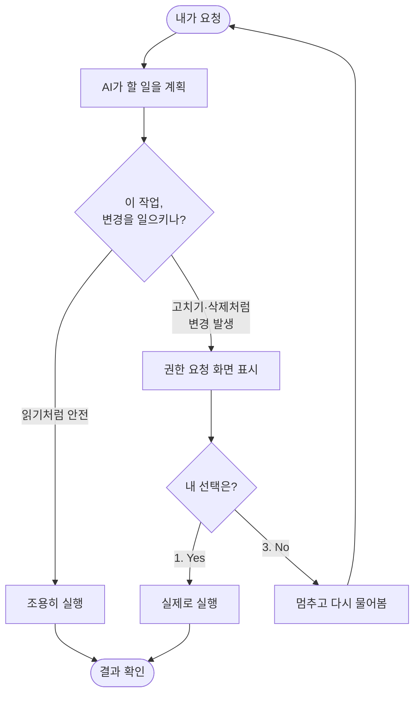

# 챕터 3: 내 컴퓨터를 다루는 AI — 파일과 폴더 작업

## 이 챕터에서 배울 것

지금까지 우리는 AI에게 파일 하나를 만들어달라고 부탁해봤고(챕터 1), 어떻게 말해야 AI가 잘 알아듣는지 배웠습니다(챕터 2). 이번 챕터에서는 한 걸음 더 나아갑니다.

이 챕터를 끝까지 따라 하면, 여러분은 **어질러진 폴더를 AI에게 통째로 맡겨 깔끔하게 정리하는 경험**을 하게 됩니다. 파일 30개의 이름을 한 번에 바꾸고, 흩어진 파일들을 종류별로 분류하고, 여러 메모를 하나로 합치는 일을 — 마우스로 일일이 끌어다 놓는 대신 — 자연어 대화 한두 줄로 끝내게 됩니다.

그런데 여기서 많은 분이 이런 걱정을 합니다.

> "AI가 내 파일을 막 건드리다가, 중요한 자료를 지우거나 망가뜨리면 어떡하지?"

아주 정당한 걱정입니다. 그래서 이 챕터는 **그 걱정을 가장 먼저 해소하는 것**으로 시작합니다. Claude Code에는 여러분의 파일을 지켜주는 안전장치가 겹겹이 들어 있어요. AI는 무언가를 바꾸기 전에 항상 **"이렇게 바꿔도 될까요?"** 하고 여러분에게 먼저 물어봅니다. 여러분이 "응"이라고 해야만 실제로 바뀝니다.

코딩을 전혀 몰라도 괜찮습니다. 이 챕터의 모든 실습은 **연습용 폴더** 안에서만 진행하므로, 여러분의 진짜 중요한 자료는 절대 건드리지 않습니다.

---

## 3.1 AI가 파일을 다루는 3가지 기본 동작

AI가 파일을 다룬다고 하면 뭔가 복잡할 것 같지만, 사실 딱 **세 가지 동작**이 전부입니다. 우리가 평소에 파일을 다루는 방식과 똑같아요.

*AI가 파일을 다루는 3가지 기본 동작*

| 동작 | 영어 이름 | 무슨 일을 하나요? | 일상에 비유하면 |
|------|----------|------------------|----------------|
| **읽기** | Read | 파일 내용을 들여다봄 | 책을 펼쳐서 읽는 것 |
| **쓰기** | Write | 새 파일을 만들어 내용을 채움 | 빈 공책에 새로 적는 것 |
| **고치기** | Edit | 기존 파일의 일부를 바꿈 | 이미 쓴 글에서 한 줄만 지우개로 고치는 것 |

Claude Code로 작업하다 보면 화면에 이 영어 단어들이 그대로 나타납니다. AI가 파일을 읽으면 `Read(파일명)`, 새로 만들면 `Write(파일명)`, 일부를 고치면 `Edit(파일명)` 이라고 표시되거든요. 그러니 이 세 단어만 기억해두면, AI가 지금 무슨 일을 하는지 한눈에 알 수 있습니다.

> **왜 이게 중요한가요?** 세 동작은 위험도가 전혀 다릅니다. **읽기**는 그냥 들여다보기만 하니 아무것도 망가지지 않아요. **새 파일 쓰기**도 없던 파일을 새로 만드는 것이라 안전하죠. 하지만 **고치기**나 **덮어쓰기**는 원래 내용이 바뀌므로 조심해야 합니다. 다행히 Claude Code는 위험한 동작일수록 더 까다롭게 여러분의 허락을 구합니다.

이 위험도 차이는 이 챕터 전체를 관통하는 핵심입니다. 3.6절에서 표로 깔끔하게 정리할 테니, 지금은 "읽기는 안전, 고치기는 조심" 정도만 머리에 담아두세요.

---

## 3.2 실습 준비 — 연습용 폴더 만들기

본격적인 실습에 앞서, **연습용 폴더**부터 만들겠습니다. 이 폴더는 일종의 안전한 놀이터예요. 여기서 무슨 일을 하든 여러분의 진짜 자료에는 아무 영향이 없습니다. 마음껏 실수해도 되는 공간이라고 생각하세요.

이 챕터의 **모든 실습은 이 연습용 폴더 안에서만** 진행됩니다.

---

### 실습 3-1: 연습용 폴더 만들고 그 안에서 Claude Code 켜기

**Step 1: 바탕화면으로 이동해서 연습용 폴더 만들기**

터미널(Windows는 PowerShell, Mac은 터미널)을 열고 아래를 입력하세요.

Windows:
```
cd Desktop
mkdir claude-practice
cd claude-practice
```

Mac:
```
cd ~/Desktop
mkdir claude-practice
cd claude-practice
```

`mkdir claude-practice` 는 "claude-practice라는 폴더를 만들어라"라는 뜻이고, `cd claude-practice` 는 "그 폴더 안으로 들어가라"라는 뜻입니다. 이제 우리는 빈 연습용 폴더 안에 들어와 있습니다.

**Step 2: 그 폴더 안에서 Claude Code 실행**

```
claude
```

처음 이 폴더에서 실행하면, 챕터 1에서 봤던 폴더 신뢰 확인이 다시 나올 수 있습니다.

```
Quick safety check: Is this a project you created or one you trust?
> 1. Yes, I trust this folder
  2. No, exit
```

방금 우리가 직접 만든 폴더이니 **1번을 선택하고 Enter** 를 누르세요.

> **왜 폴더 안에서 켜야 하나요?** Claude Code는 **자기가 실행된 폴더와 그 하위 폴더**를 작업 무대로 삼습니다. 연습용 폴더 안에서 켜면, AI의 작업 범위가 자연스럽게 이 폴더 안으로 한정돼요. 바깥의 다른 자료는 무대 밖에 있는 셈이라 한층 더 안심할 수 있습니다.

이제 `>` 프롬프트가 깜빡이면 준비 완료입니다. 다음 절부터 이 폴더를 무대로 신나게 실습해봅시다.

---

## 3.3 읽기와 쓰기 — 가장 안전한 첫걸음

가장 안전한 동작인 **읽기**와 **새 파일 쓰기**부터 시작하겠습니다. 이 두 동작은 기존 자료를 망가뜨릴 일이 없으니 마음 편히 따라 하세요.

먼저 AI에게 연습용 파일 몇 개를 만들어달라고 부탁해서, 앞으로 다룰 재료를 준비하겠습니다.

---

### 실습 3-2: AI에게 연습용 파일 만들어달라고 하기

`>` 프롬프트에 아래와 같이 입력하세요.

```
연습용으로 메모 파일 3개를 만들어줘.
- shopping.txt: 장보기 목록 (우유, 계란, 빵)
- todo.txt: 할 일 목록 (청소, 빨래, 운동)
- diary.txt: 오늘 일기 한 줄
```

AI가 파일 세 개를 차례로 만들어줍니다.

```
연습용 메모 파일 3개를 만들겠습니다.

● Write(shopping.txt)
  ⎿  우유
     계란
     빵

● Write(todo.txt)
  ⎿  청소
     빨래
     운동

● Write(diary.txt)
  ⎿  오늘은 Claude Code로 파일 정리를 배웠다. 생각보다 쉬웠다!

✓ 파일 3개를 만들었습니다.
```

`Write(...)` 표시가 보이시죠? AI가 **새 파일을 쓰는** 동작을 했다는 뜻입니다. 새 파일을 만드는 건 안전한 동작이라 Claude Code가 비교적 거침없이 진행합니다.

이제 만들어진 파일을 AI에게 읽어달라고 해볼까요?

```
shopping.txt 파일에 뭐라고 적혀 있는지 읽어줘
```

```
shopping.txt 파일을 읽어보겠습니다.

● Read(shopping.txt)
  ⎿  우유
     계란
     빵

shopping.txt에는 장보기 목록으로 우유, 계란, 빵이 적혀 있습니다.
```

`Read(...)`는 파일을 **들여다보기만** 하는 동작입니다. 내용을 바꾸지 않으니 세상에서 가장 안전한 동작이에요. AI가 여러분 파일의 내용을 파악할 때 항상 먼저 하는 일이기도 합니다.

스스로 해보기:
```
diary.txt 파일을 읽고, 내용을 더 길고 자세하게 다시 써줘
```

---

## 3.4 고치기 — 그리고 변경 전 미리보기(diff)

이제 조금 더 조심스러운 동작인 **고치기(Edit)** 차례입니다. 기존 파일의 내용을 바꾸는 일이죠. 여기서 Claude Code의 가장 든든한 안전장치가 등장합니다. 바로 **변경 전 미리보기**, 줄여서 **diff**입니다.

AI는 파일을 고치기 직전에, **"이 부분을 이렇게 바꿀 거예요. 괜찮나요?"** 하고 바뀔 내용을 미리 보여줍니다. 여러분은 그 미리보기를 보고 **승인할지 거부할지** 결정할 수 있어요. 승인하기 전까지는 파일이 **절대 바뀌지 않습니다.**

### diff 읽는 법

미리보기 화면에는 두 가지 색깔의 줄이 나옵니다.

*diff 미리보기에서 +/- 줄의 의미*

```
  - 빨간색 줄 (앞에 - 기호)  →  지워질 내용
  + 초록색 줄 (앞에 + 기호)  →  새로 들어갈 내용
    색 없는 줄              →  그대로 유지되는 내용
```

`-`로 시작하는 줄은 **사라질 내용**, `+`로 시작하는 줄은 **새로 추가될 내용**입니다. 이 두 줄만 비교해보면 "무엇이 어떻게 바뀌는지" 정확히 알 수 있어요.

---

### 실습 3-3: 파일 고치기 미리보기 보고 승인하기

장보기 목록에 항목을 하나 추가해보겠습니다.

```
shopping.txt에 "사과"를 추가해줘
```

AI가 곧바로 파일을 바꾸지 않고, 먼저 **미리보기**를 보여줍니다.

```
shopping.txt에 사과를 추가하겠습니다. 변경 내용을 확인해주세요.

● Edit(shopping.txt)
  ⎿  우유
     계란
     빵
  +  사과

Do you want to make this edit to shopping.txt?
> 1. Yes
  2. Yes, and don't ask again this session
  3. No, and tell Claude what to do differently (Esc)
```

화면 아래쪽을 보세요. **"이 편집을 적용할까요?"** 라고 물으며 선택지를 줍니다. `+ 사과` 한 줄이 새로 추가되는 것이 보이시죠? 우리가 의도한 그대로입니다.

**1번(Yes)을 선택하고 Enter** 를 누르세요.

```
● Edit(shopping.txt)
  ⎿  우유
     계란
     빵
     사과

✓ shopping.txt를 수정했습니다.
```

승인하자 비로소 파일이 실제로 바뀌었습니다. **여러분이 "Yes"라고 하기 전까지는 파일이 그대로였다는 점**이 핵심입니다.

> **선택지가 3개나 되네요?** 각각의 뜻은 이렇습니다.
> - **1. Yes** — 이번 변경만 승인합니다. 가장 많이 쓰는 선택지예요.
> - **2. Yes, and don't ask again this session** — 지금부터 이 종류의 작업은 묻지 말고 알아서 하라는 뜻입니다. 익숙해지기 전까지는 권하지 않아요.
> - **3. No** — 거부합니다. 다음 절에서 자세히 다룹니다.

---

### 실습 3-4: "거부"로 원치 않는 변경 막기

미리보기의 진짜 가치는 **거부할 수 있다는 점**에 있습니다. AI가 우리 의도와 다르게 이해했을 때, "No"를 눌러 변경을 막고 방향을 바로잡을 수 있어요.

일부러 애매하게 요청해서 거부를 연습해봅시다.

```
todo.txt를 정리해줘
```

"정리"라는 말이 애매하다 보니, AI가 우리 생각과 다르게 해석할 수 있습니다. 예를 들어 항목을 멋대로 지워버리는 식으로요.

```
todo.txt를 우선순위 순으로 정리하고 중복을 제거하겠습니다.

● Edit(todo.txt)
  ⎿  - 청소
     - 빨래
  +  운동
  -  빨래

Do you want to make this edit to todo.txt?
> 1. Yes
  2. Yes, and don't ask again this session
  3. No, and tell Claude what to do differently (Esc)
```

어라, 미리보기를 보니 `- 빨래`가 지워지려 하네요! 우리는 빨래를 지우라고 한 적이 없는데 말이죠. 이럴 때 바로 **3번(No)을 선택**합니다. (또는 **Esc** 키를 눌러도 됩니다.)

```
변경을 취소했습니다. 어떻게 해드릴까요?
```

거부하자 AI가 멈추고 다시 물어봅니다. 이제 우리가 원하는 바를 정확히 다시 말해주면 됩니다.

```
아무것도 지우지 말고, 항목 순서만 운동-청소-빨래로 바꿔줘
```

이렇게 미리보기와 거부를 활용하면, AI가 실수하려는 순간을 **변경이 일어나기 전에** 잡아낼 수 있습니다. 파일은 여러분이 승인하지 않는 한 안전합니다.

> **기억하세요:** 미리보기 화면이 떴다는 건 "아직 아무것도 안 바뀌었다"는 뜻입니다. 내용이 마음에 안 들면 마음 편히 거부하세요. 거부는 잘못이 아니라, AI를 길들이는 정상적인 과정입니다.

---

## 3.5 권한 요청 화면 이해하기 — AI가 허락을 구하는 예의

지금까지 본 "Yes / No" 선택 화면, 이게 바로 **권한 요청**입니다. 처음엔 자꾸 뭘 물어봐서 번거롭게 느껴질 수도 있어요. 하지만 관점을 살짝 바꿔보면 이건 굉장히 고마운 기능입니다.

권한 요청은 **AI가 여러분 집(컴퓨터)에서 무언가 하기 전에 먼저 노크하고 허락을 구하는 예의**입니다. 좋은 손님이 남의 집 냉장고를 함부로 열지 않고 "이거 좀 먹어도 될까요?" 하고 묻는 것처럼요. AI가 묻는다는 건, 곧 **여러분이 모든 결정권을 쥐고 있다는 뜻**입니다.

*권한 요청이 일어나는 흐름*



핵심은 이겁니다. **변경을 일으키는 작업일수록 AI는 반드시 멈춰서 물어본다.** 여러분이 잠깐 한눈을 팔아도, AI는 허락 없이 함부로 일을 저지르지 않습니다.

### 권한 요청에서 자주 보는 선택지

작업 종류에 따라 화면 문구는 조금씩 다르지만, 큰 틀은 항상 같습니다.

*권한 요청 선택지의 의미*

| 선택지 | 의미 | 언제 고르나요? |
|--------|------|---------------|
| **1. Yes** | 이번 한 번만 허락 | 미리보기를 확인했고 괜찮을 때 (가장 자주 사용) |
| **2. Yes, and don't ask again this session** | 이 종류는 앞으로 묻지 않음 | 같은 작업을 여러 번 반복할 때만, 신중히 |
| **3. No** | 거부하고 방향 수정 | 미리보기가 의도와 다를 때 |

> **초보자를 위한 조언:** 익숙해지기 전까지는 **2번을 피하고 항상 1번 또는 3번**을 쓰세요. 매번 미리보기를 직접 확인하는 습관이, 여러분의 파일을 지키는 가장 확실한 방법입니다. 조금 번거롭더라도 이게 안전합니다.

---

## 3.6 위험한 작업 vs 안전한 작업

이쯤에서 "그래서 정확히 뭐가 안전하고 뭐가 위험한 건데?"라는 궁금증이 생길 겁니다. 한 표로 깔끔하게 정리하겠습니다. 이 표는 이 챕터에서 가장 중요한 한 장이니, 접어두고 두고두고 참고하세요.

*안전한 작업과 조심해야 할 작업*

| 안전한 작업 ✅ | 왜 안전한가 | 조심할 작업 ⚠️ | 왜 조심해야 하나 |
|---------------|------------|----------------|-----------------|
| **읽기 (Read)** | 들여다보기만 함, 아무것도 안 바뀜 | **덮어쓰기 (Overwrite)** | 원래 내용이 통째로 사라짐 |
| **새 파일 만들기 (Write)** | 없던 파일이 새로 생길 뿐 | **여러 줄 고치기 (Edit)** | 잘못 고치면 원래 내용 손상 |
| **복사하기 (Copy)** | 원본은 그대로 남음 | **이동하기 (Move)** | 원래 위치에서 사라짐 |
| **새 폴더 만들기** | 빈 공간이 생길 뿐 | **삭제하기 (Delete)** | 파일이 없어짐, 되돌리기 어려움 |

오른쪽 "조심할 작업"들은 모두 **무언가가 사라지거나 바뀌는** 작업입니다. 그래서 Claude Code는 이런 작업 앞에서 반드시 권한 요청 화면을 띄우고, 여러분의 명시적인 승인을 기다립니다.

> **가장 조심해야 할 한 가지: 삭제와 덮어쓰기.** 새로 만들거나 고치는 건 되돌릴 여지가 있지만, 지워버린 파일이나 통째로 덮어쓴 내용은 되살리기 어렵습니다. 그래서 다음 절에서 "되돌리기"를 따로 다룹니다. 삭제·덮어쓰기 요청을 승인하기 전에는 **미리보기를 한 번 더** 천천히 읽어보세요.

---

## 3.7 실수했을 때 되돌리기

안전장치가 아무리 좋아도, 우리는 사람이라 실수합니다. 깜빡하고 승인을 눌렀는데 결과가 마음에 안 들 수도 있죠. 그럴 때 어떻게 되돌리는지 알아두면, 한결 마음 놓고 작업할 수 있습니다.

### 방법 1: AI에게 그냥 "되돌려줘"라고 말하기

가장 쉬운 방법입니다. Claude Code는 방금 자기가 한 작업을 기억하고 있어서, 말로 되돌려달라고 하면 됩니다.

```
방금 한 수정을 되돌려줘. shopping.txt를 원래대로 돌려놔줘
```

```
shopping.txt를 직전 상태로 되돌리겠습니다.

● Edit(shopping.txt)
  ⎿  우유
     계란
     빵
  -  사과

✓ 사과 항목을 제거해 원래 상태로 되돌렸습니다.
```

되돌리기도 결국 하나의 "고치기" 작업이라, 똑같이 미리보기와 승인을 거칩니다. 안전하게 원상 복구할 수 있죠.

### 방법 2: 대화 자체를 되감기 — Esc 두 번

Claude Code에는 대화를 이전 시점으로 되감는 기능도 있습니다. 키보드에서 **Esc를 두 번 빠르게** 누르면, 이전 대화 지점들의 목록이 나타나고 원하는 시점으로 돌아갈 수 있어요. "아까 그 작업을 시키기 전으로 돌아가고 싶다" 싶을 때 유용합니다.

### 가장 강력한 되돌리기 안전망은 "예방"

사실 가장 좋은 되돌리기는 **애초에 되돌릴 일을 안 만드는 것**입니다. 그 방법을 표로 정리하면 이렇습니다.

*되돌리기보다 더 강력한 예방 습관*

| 습관 | 효과 |
|------|------|
| **연습용 폴더에서만 실습하기** | 진짜 자료는 처음부터 무대 밖 |
| **미리보기를 꼭 읽고 승인하기** | 실수가 일어나기 전에 차단 |
| **삭제·덮어쓰기는 한 번 더 확인** | 가장 위험한 작업에 집중력 배분 |
| **중요한 폴더는 미리 복사해두기** | 최악의 경우에도 원본 보존 |

> **솔직한 안내:** Claude Code의 되돌리기는 만능이 아닙니다. 특히 파일을 완전히 **삭제**한 경우, 휴지통을 거치지 않고 사라졌다면 되살리기 어려울 수 있어요. 그래서 정말 소중한 자료를 다룰 때는, 작업 전에 그 폴더를 한 번 복사해두는 것이 가장 확실합니다. 우리가 연습용 폴더를 쓰는 이유가 바로 이것입니다.

---

## 3.8 여러 파일을 한꺼번에 다루기

이제 Claude Code의 진짜 매력을 느낄 차례입니다. 파일 하나가 아니라 **수십 개를 한 번에** 다루는 일이죠. 손으로 하면 30분 걸릴 일을 대화 한 줄로 끝낼 수 있습니다.

안전하게 실습하기 위해, 먼저 AI에게 **연습용 더미 파일**을 잔뜩 만들게 한 다음 그것들을 정리하겠습니다. 진짜 자료가 아니라 우리가 방금 만든 가짜 파일이니 마음껏 주물러도 됩니다.

---

### 실습 3-5: 일괄 이름 변경

**Step 1: 연습용 더미 파일 만들기**

```
연습용 더미 파일을 만들어줘.
photo1.jpg부터 photo5.jpg까지, 그리고 그 안에는 각각 "사진 1", "사진 2" 식으로 적어줘
```

```
연습용 사진 파일 5개를 만들겠습니다.

● Write(photo1.jpg)
  ⎿  사진 1
● Write(photo2.jpg)
  ⎿  사진 2
● Write(photo3.jpg)
  ⎿  사진 3
● Write(photo4.jpg)
  ⎿  사진 4
● Write(photo5.jpg)
  ⎿  사진 5

✓ 더미 파일 5개를 만들었습니다.
```

> 실제 사진이 아니라 글자만 든 연습용 파일이지만, 이름이 `.jpg`라서 이름 바꾸기 실습에는 충분합니다.

**Step 2: 한 번에 이름 바꾸기**

이제 다섯 파일의 이름을 한 번에 바꿔봅시다.

```
photo1.jpg ~ photo5.jpg 파일 이름을
여행사진_01.jpg ~ 여행사진_05.jpg 로 한꺼번에 바꿔줘
```

```
사진 파일 5개의 이름을 일괄 변경하겠습니다.

  photo1.jpg  →  여행사진_01.jpg
  photo2.jpg  →  여행사진_02.jpg
  photo3.jpg  →  여행사진_03.jpg
  photo4.jpg  →  여행사진_04.jpg
  photo5.jpg  →  여행사진_05.jpg

이대로 진행할까요?
> 1. Yes
  2. Yes, and don't ask again this session
  3. No, and tell Claude what to do differently (Esc)

✓ 파일 5개의 이름을 변경했습니다.
```

마우스로 하나하나 이름을 바꾸려면 다섯 번 클릭하고 다섯 번 타이핑해야 했을 일을, 문장 한 줄로 끝냈습니다. 파일이 50개, 100개여도 똑같이 한 줄이면 됩니다.

> **여기서도 미리보기가 작동합니다.** AI는 "어떤 파일이 어떤 이름으로 바뀌는지"를 화살표(`→`)로 먼저 보여주고 승인을 구합니다. 목록을 쭉 훑어보고 이상이 없을 때만 Yes를 누르세요.

---

### 실습 3-6: 어질러진 폴더를 종류별로 분류하기

이번엔 여러 종류의 파일이 뒤섞인 상황을 만들고, 그걸 폴더별로 깔끔하게 분류해보겠습니다.

**Step 1: 뒤섞인 더미 파일 만들기**

```
어질러진 폴더를 흉내내게 더미 파일을 만들어줘.
- 이미지: cat.jpg, dog.jpg
- 문서: report.txt, memo.txt
- 표: budget.csv
전부 이 폴더 바로 아래에 흩어놓고, 안에는 아무 짧은 내용이나 채워줘
```

AI가 파일 다섯 개를 한 폴더에 흩어 만들어줍니다. 지금 우리 폴더는 이렇게 어질러진 상태입니다.

*분류 전 — 한 폴더에 모든 게 뒤섞여 있음*

```
claude-practice/
├── cat.jpg
├── dog.jpg
├── report.txt
├── memo.txt
└── budget.csv
```

**Step 2: 종류별로 분류 요청**

```
이 폴더의 파일들을 종류별로 폴더를 만들어서 정리해줘.
이미지는 images 폴더, 문서는 documents 폴더, 표는 sheets 폴더로 옮겨줘
```

AI는 폴더를 만들고(안전한 작업) 파일을 옮기기(조심할 작업) 전에 계획을 보여주며 승인을 구합니다.

```
파일을 종류별로 분류하겠습니다. 계획은 다음과 같습니다.

  📁 images 폴더 생성   →  cat.jpg, dog.jpg 이동
  📁 documents 폴더 생성 →  report.txt, memo.txt 이동
  📁 sheets 폴더 생성    →  budget.csv 이동

파일을 이동(Move)하면 원래 위치에서는 사라집니다. 진행할까요?
> 1. Yes
  2. Yes, and don't ask again this session
  3. No, and tell Claude what to do differently (Esc)

✓ 폴더 3개를 만들고 파일 5개를 분류했습니다.
```

승인 후 폴더를 보면 이렇게 깔끔하게 정리됩니다.

*분류 후 — 종류별 폴더로 깔끔하게*

```
claude-practice/
├── images/
│   ├── cat.jpg
│   └── dog.jpg
├── documents/
│   ├── report.txt
│   └── memo.txt
└── sheets/
    └── budget.csv
```

AI가 친절하게 **"이동하면 원래 위치에서는 사라집니다"** 라고 미리 경고해준 점에 주목하세요. 조심할 작업일수록 AI는 한 번 더 일러줍니다.

---

### 실습 3-7: 여러 파일을 하나로 합치기

흩어진 메모 여러 개를 하나의 파일로 합치는 것도 단골 작업입니다. 앞서 만든 메모 파일들을 하나로 모아보겠습니다.

```
shopping.txt, todo.txt, diary.txt 세 파일의 내용을
all-notes.txt 라는 새 파일 하나로 합쳐줘.
각 내용 앞에 어느 파일에서 왔는지 제목을 붙여줘
```

```
세 파일을 읽어 하나로 합치겠습니다.

● Read(shopping.txt)
● Read(todo.txt)
● Read(diary.txt)

● Write(all-notes.txt)
  ⎿  === shopping.txt ===
     우유
     계란
     사과

     === todo.txt ===
     운동
     청소
     빨래

     === diary.txt ===
     오늘은 Claude Code로 파일 정리를 배웠다. 생각보다 쉬웠다!

✓ 3개 파일을 all-notes.txt로 합쳤습니다.
```

여기서 흐름을 잘 보세요. AI는 먼저 세 파일을 **읽고(Read)**, 그 내용을 모아 **새 파일을 썼습니다(Write)**. 원래 세 파일은 건드리지 않았으니, 합치기는 사실 안전한 작업입니다. 원본은 그대로 남아 있어요.

스스로 해보기: 반대로 쪼개기도 해보세요.
```
all-notes.txt를 다시 제목별로 나눠서
note-1.txt, note-2.txt, note-3.txt 세 파일로 쪼개줘
```

---

## 3.9 종합 실습 — 어질러진 폴더 5분 정리

배운 걸 모두 합쳐, 실제로 자주 마주치는 상황을 한 번에 처리해보겠습니다. 다운로드 폴더가 온갖 파일로 어질러진 상황을 연습용 폴더 안에 재현하고, 깨끗하게 정돈하는 종합 실습입니다.

---

### 실습 3-8: 다운로드 폴더 정리 시뮬레이션

**Step 1: 어질러진 다운로드 폴더 재현**

```
다운로드 폴더가 어질러진 상황을 messy-downloads 라는 폴더 안에 흉내내줘.
이미지 3개, PDF 흉내 파일 2개, 텍스트 메모 4개를 아무 이름으로 섞어서 만들어줘
```

**Step 2: AI에게 정리 계획부터 물어보기**

바로 정리시키지 말고, 먼저 **어떻게 정리할지 계획을 물어보는** 습관을 들이면 좋습니다. (이건 챕터 5에서 더 깊이 배웁니다.)

```
messy-downloads 폴더를 어떻게 정리하면 좋을지 계획부터 알려줘.
아직 실제로 옮기지는 말고
```

```
messy-downloads 폴더를 살펴봤습니다. 다음과 같이 정리하길 제안합니다.

  📁 images/    →  이미지 파일 3개
  📁 pdfs/      →  PDF 파일 2개
  📁 notes/     →  텍스트 메모 4개

이대로 정리해드릴까요? 진행하라고 하시면 실제로 옮기겠습니다.
```

"아직 실제로 옮기지 말라"고 했더니, AI가 **계획만 세우고 멈춰서** 우리 결정을 기다립니다. 계획이 마음에 들면 이제 실행시키면 됩니다.

**Step 3: 승인하고 실행**

```
좋아, 그 계획대로 정리해줘
```

```
계획대로 정리하겠습니다. 폴더를 만들고 파일을 이동합니다.

  📁 images/ 생성  →  3개 이동
  📁 pdfs/ 생성    →  2개 이동
  📁 notes/ 생성   →  4개 이동

파일 이동은 원래 위치에서 사라집니다. 진행할까요?
> 1. Yes
  2. Yes, and don't ask again this session
  3. No, and tell Claude what to do differently (Esc)

✓ messy-downloads 폴더를 깔끔하게 정리했습니다.
```

5분도 안 걸려서, 손으로 하면 한참 걸렸을 정리를 끝냈습니다. 그것도 매 단계 미리보기를 확인하며 안전하게요.

---

스스로 해보기 (선택, 조심해서!):

이제 진짜 응용입니다. **여러분의 실제 다운로드 폴더**를 정리해보고 싶을 수 있어요. 도전해도 좋지만, 다음을 꼭 지키세요.

1. **먼저 다운로드 폴더를 통째로 복사해 백업**해두세요. (마우스로 폴더를 복사·붙여넣기하면 됩니다.)
2. Claude Code를 다운로드 폴더에서 켜거나, 그 폴더 경로를 명확히 지정하세요.
3. **"아직 옮기지 말고 계획부터 보여줘"** 로 시작하세요.
4. 미리보기를 천천히 읽고, 이상하면 망설임 없이 **No**.
5. 삭제는 시키지 말고, **이동과 분류만** 하세요.

이 다섯 가지만 지키면, 실제 자료를 다룰 때도 안전합니다.

---

## 이 챕터에서 배운 것

- AI가 파일을 다루는 기본 동작은 **읽기(Read)·쓰기(Write)·고치기(Edit)** 세 가지다
- **읽기와 새 파일 만들기는 안전**하고, **고치기·이동·삭제·덮어쓰기는 조심**해야 한다
- AI는 파일을 바꾸기 전에 **미리보기(diff)** 를 보여준다 — `-`는 사라질 내용, `+`는 추가될 내용
- **권한 요청 화면(Yes/No)** 은 AI가 허락을 구하는 예의이며, 모든 결정권은 나에게 있다
- 미리보기가 의도와 다르면 **No(또는 Esc)** 로 거부하고 방향을 바로잡는다
- 익숙해지기 전까지는 "묻지 않기(2번)"를 피하고 항상 **1번 또는 3번**을 쓴다
- 실수는 **"되돌려줘"** 한마디나 **Esc 두 번**으로 되감을 수 있다 — 단, 삭제는 되살리기 어려우니 예방이 최선
- 일괄 이름 변경, 종류별 분류, 합치기·쪼개기 같은 **여러 파일 작업을 대화 한 줄로** 끝낼 수 있다
- 모든 작업은 **연습용 폴더 안에서** 했고, 실제 자료를 다룰 땐 **백업 후 계획부터** 확인한다

## 다음 챕터 예고

여기까지 오면서 여러분은 AI에게 파일을 만들고 고치고 정리하게 하는 법을 익혔습니다. 그런데 지금까지 만든 건 전부 텍스트 파일이었죠. 다음 챕터에서는 드디어 **눈에 보이는 결과물**을 만듭니다. 코드를 한 줄도 직접 쓰지 않고도, 브라우저에 뜨는 나만의 웹페이지와 작동하는 작은 프로그램을 만들어볼 거예요. "내가 진짜 뭔가를 만들었다"는 짜릿한 성취감이 기다리고 있습니다.
