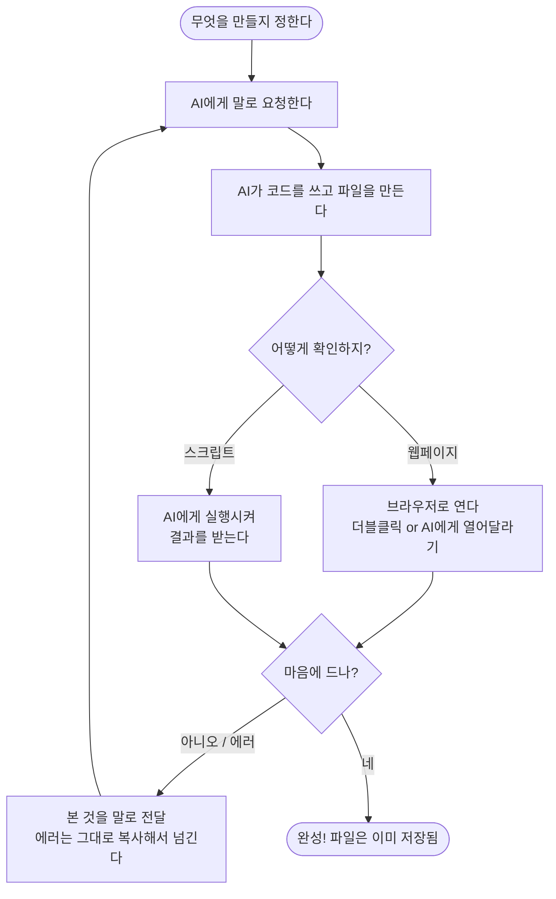

# 챕터 4: 코딩 몰라도 만드는 첫 결과물 — 작은 프로그램과 웹페이지

## 이 챕터에서 배울 것

지금까지 여러분은 Claude Code를 설치하고(챕터 1), 잘 말하는 법을 익히고(챕터 2), 파일과 폴더를 다뤄봤습니다(챕터 3).

이번 챕터는 조금 다릅니다. **드디어 "내가 만든 것"이 화면에 뜨는 순간**을 경험하게 됩니다.

이 챕터를 끝까지 따라 하면, 여러분은 코드를 단 한 줄도 직접 쓰지 않고도:

- 나만의 웹페이지를 만들어 브라우저에 띄우고
- 디지털 시계, 계산기 같은 진짜로 동작하는 작은 프로그램을 만들고
- 에러가 나도 당황하지 않고 AI에게 넘겨 고치고
- AI에게 인터넷에서 최신 정보를 찾아오게 시키고
- 완성한 결과물을 저장했다가 나중에 다시 열 수 있게 됩니다.

코드를 읽을 줄 몰라도 괜찮습니다. **코드는 AI가 씁니다. 우리는 "무엇을 만들지"와 "어떻게 고칠지"만 정하면 됩니다.** 운전을 할 때 엔진이 어떻게 돌아가는지 몰라도 목적지까지 갈 수 있는 것처럼요.

자, 첫 결과물을 만들러 가봅시다.

---

## 4.1 이 챕터의 핵심 — "만들고 → 보고 → 고쳐달라" 루프

본격적으로 시작하기 전에, 이 챕터 전체를 관통하는 **단 하나의 작업 패턴**을 먼저 소개할게요. 이것만 익히면 여러분은 사실상 무엇이든 만들 수 있습니다.

그 패턴은 이렇습니다:

```
   ① 만들어달라고 한다  →  ② 실행해서 결과를 본다  →  ③ 고쳐달라고 한다
        (요청)                  (확인)                   (수정)
          ▲                                                 │
          └─────────────────────────────────────────────────┘
                        마음에 들 때까지 반복
```

전문 개발자도 사실 똑같이 일합니다. 한 번에 완벽한 결과물을 만드는 사람은 없어요. **만들고, 돌려보고, 고치고**를 수십 번 반복하면서 완성해 갑니다.

차이가 있다면, 여러분은 그 "고치기"를 직접 손으로 하지 않고 **AI에게 말로 시킨다**는 점뿐입니다.

> **비유하자면:** 사진을 보정할 때를 떠올려보세요. "조금 더 밝게", "그건 너무 밝다, 살짝 어둡게", "이제 따뜻한 색감으로". 우리는 사진 보정 알고리즘을 몰라도 원하는 결과를 말로 요청합니다. 웹페이지 만들기도 똑같습니다.

이 루프를 기억하면서 첫 예제로 가봅시다. 5분 안에 화면에 결과가 뜰 거예요.

---

## 4.2 첫 결과물 — 나만의 자기소개 웹페이지 (5분 완성)

말로만 설명하는 건 여기까지. 직접 만들어봅시다.

가장 먼저 만들 것은 **나를 소개하는 웹페이지**입니다. 브라우저에 띄우면 진짜 홈페이지처럼 보이는 그런 페이지요.

### 작업 폴더 준비하기

먼저 이번 챕터의 결과물을 모아둘 폴더를 만들겠습니다. Claude Code를 실행한 상태에서 이렇게 요청하세요.

```
> 바탕화면에 my-web 이라는 폴더를 만들어줘. 이번 챕터 연습 결과물을 여기 모아둘 거야.

● Bash(mkdir my-web)
  ⎿ (폴더 생성됨)

✓ 바탕화면에 my-web 폴더를 만들었어요. 앞으로 만드는 파일은 모두 이 폴더 안에 넣을게요.
```

---

### 실습 4-1: 자기소개 웹페이지 만들기

Claude Code 프롬프트(`>`)에 이렇게 입력하세요. 괄호 안 내용은 여러분 것으로 바꿔도 됩니다.

```
my-web 폴더 안에 about.html 파일을 만들어줘.
나를 소개하는 웹페이지야.
- 제목: "안녕하세요, 김클로드입니다"
- 짧은 자기소개 한 문단 (취미는 등산과 사진)
- 좋아하는 것 3가지를 목록으로
- 배경은 부드러운 하늘색, 글자는 가운데 정렬
보기 좋게 예쁘게 만들어줘.
```

여기서 중요한 점 하나. 우리는 **"어떻게 만들지(코드)"는 한마디도 하지 않았습니다.** "무엇을, 어떤 느낌으로"만 말했어요. 색깔, 정렬, 내용 같은 **결과의 방향**만 정해준 겁니다. HTML이 뭔지, CSS가 뭔지 전혀 몰라도 됩니다.

Claude Code가 응답하며 파일을 만들어줄 거예요.

```
요청하신 자기소개 페이지를 만들겠습니다.

● Write(my-web/about.html)
  ⎿  <!DOCTYPE html>
     <html lang="ko">
       <body style="background-color: lightblue; text-align: center;">
         <h1>안녕하세요, 김클로드입니다</h1>
         <p>등산과 사진을 좋아하는 사람입니다.</p>
         <ul>
           <li>커피</li>
           <li>여행</li>
           <li>고양이</li>
         </ul>
       </body>
     </html>

✓ about.html 파일을 만들었습니다. 이 파일을 더블클릭하면 브라우저에서 바로 볼 수 있어요.
```

---

### 만든 결과물을 화면에 띄워보기

파일이 만들어졌습니다. 이제 **진짜로 보는** 단계입니다. 방법은 두 가지예요.

**방법 A — 파일을 직접 더블클릭 (가장 쉬움)**

웹페이지 파일(`.html`)은 그냥 더블클릭하면 브라우저(크롬, 엣지, 사파리 등)에서 열립니다.

- **Windows:** 파일 탐색기에서 `my-web` 폴더를 열고 `about.html`을 더블클릭
- **Mac:** Finder에서 `my-web` 폴더를 열고 `about.html`을 더블클릭

브라우저가 열리면서 여러분이 방금 "말로 만든" 웹페이지가 화면에 나타납니다.

**방법 B — AI에게 열어달라고 하기**

파일 탐색기를 여는 것도 번거롭다면, AI에게 직접 시켜도 됩니다.

```
> 방금 만든 about.html을 브라우저에서 열어줘.

● Bash(start my-web/about.html)
  ⎿  이 명령을 실행하면 기본 브라우저로 about.html이 열립니다.

Do you want to run this command?
> 1. Yes
  2. Yes, and don't ask again this session
  3. No, and tell Claude what to do differently (Esc)
```

**1번(Yes)을 선택하고 Enter** 를 누르면, 잠시 뒤 브라우저가 열립니다.

```
● Bash(start my-web/about.html)
  ⎿ (브라우저에서 열림)

✓ about.html을 브라우저로 열었어요. 하늘색 배경의 자기소개 페이지가 보이나요?
```

> **참고:** AI가 브라우저를 여는 명령을 실행할 때 "이 명령을 실행해도 될까요?"라고 권한을 물어볼 수 있습니다. 챕터 3에서 배운 것처럼, 안전한 작업이니 **승인(1번)** 을 누르면 됩니다.

화면에 하늘색 배경의 자기소개 페이지가 떴나요?

**축하합니다. 방금 여러분은 코드를 한 줄도 쓰지 않고 웹페이지를 만들었습니다.** 이게 바로 "내가 진짜 뭔가를 만들었다"는 그 느낌입니다.

---

### 마음에 안 드는 부분 고치기 (루프의 핵심)

페이지를 보니 뭔가 아쉬운 부분이 있을 거예요. 바로 그 순간이 **루프의 ③번 "고쳐달라"** 단계입니다.

본 결과를 그대로 말로 표현하면 됩니다.

```
방금 만든 about.html에서 배경색을 하늘색 말고 연한 분홍색으로 바꿔줘.
그리고 제목 글자를 좀 더 크게 키워줘.
```

```
배경색과 제목 크기를 바꾸겠습니다. 변경 내용을 확인해주세요.

● Edit(my-web/about.html)
  ⎿  - <body style="background-color: lightblue; text-align: center;">
     + <body style="background-color: lightpink; text-align: center;">
     -   <h1>안녕하세요, 김클로드입니다</h1>
     +   <h1 style="font-size: 3rem;">안녕하세요, 김클로드입니다</h1>

✓ about.html을 수정했습니다. 브라우저에서 새로고침(F5)하면 연한 분홍색 배경과 더 커진 제목을 볼 수 있어요.
```

고친 다음에는 **브라우저에서 새로고침(F5 또는 Ctrl+R / Cmd+R)** 만 누르면 바뀐 결과가 바로 보입니다. 파일을 다시 열 필요 없어요.

이 "보고 → 고치고 → 새로고침" 을 마음에 들 때까지 반복하세요. 글자 색, 글꼴 크기, 문단 추가, 이모지 넣기... 무엇이든 말로 요청하면 됩니다.

> **핵심:** 한 번에 완벽하게 만들려고 애쓰지 마세요. 일단 만들고, 보고, 고치는 게 훨씬 빠르고 즐겁습니다.

스스로 해보기: 위 페이지에 여러분의 **SNS 링크**나 **좋아하는 명언**을 추가해달라고 요청해보세요. 예: `맨 아래에 "오늘도 화이팅!"이라는 응원 문구를 작은 글씨로 추가해줘.`

---

## 4.3 진짜로 "동작하는" 것 만들기 — 디지털 시계

자기소개 페이지는 정보를 보여주는 정적인 페이지였습니다. 이번엔 **움직이는 것**, 실제로 동작하는 프로그램을 만들어볼게요.

만들 것은 **디지털 시계**입니다. 페이지를 열면 현재 시각이 1초마다 실시간으로 째깍째깍 바뀌는 시계요.

---

### 실습 4-2: 실시간 디지털 시계 만들기

```
my-web 폴더에 clock.html 파일을 만들어줘.
현재 시각을 큰 글씨로 보여주는 디지털 시계야.
- 시:분:초 형식으로 1초마다 자동으로 바뀌게
- 검정 배경에 초록색 글씨 (옛날 전자시계 느낌)
- 화면 정중앙에 크게
```

```
1초마다 시각이 바뀌는 디지털 시계를 만들겠습니다.

● Write(my-web/clock.html)
  ⎿  <!DOCTYPE html>
     <html lang="ko">
       <body style="background-color: black; text-align: center;">
         <div id="clock" style="color: limegreen; font-size: 5rem;"></div>
         <script>
           function updateClock() {
             const now = new Date();
             document.getElementById("clock").textContent =
               now.toLocaleTimeString("ko-KR");
           }
           setInterval(updateClock, 1000);
           updateClock();
         </script>
       </body>
     </html>

✓ clock.html 파일을 만들었습니다. 이 파일을 더블클릭해서 열어보세요. 숫자가 1초마다 바뀌면 성공이에요.
```

만든 다음 `clock.html`을 더블클릭해서 브라우저로 열어보세요. **숫자가 1초마다 바뀌고 있다면 성공입니다.**

화면 속에서 시간이 실제로 흐르고 있죠? 단순한 글자가 아니라 "동작하는 프로그램"을 만든 거예요. 이런 게 가능한 이유는, 우리가 "1초마다 바뀌게"라는 **원하는 동작**을 말로 설명했고 AI가 그걸 코드로 옮겨줬기 때문입니다.

---

### 더 욕심내기

이제 루프를 돌려 시계를 더 멋지게 만들어봅시다.

```
방금 만든 시계에 오늘 날짜(예: 2026년 6월 15일 일요일)도 시간 위에 같이 보여줘.
```

```
시간 위에 오늘 날짜도 함께 보여주도록 고치겠습니다.

● Edit(my-web/clock.html)
  ⎿    <body style="background-color: black; text-align: center;">
     +   <div id="date" style="color: limegreen; font-size: 2rem;"></div>
         <div id="clock" style="color: limegreen; font-size: 5rem;"></div>
  ⎿            const now = new Date();
     +         document.getElementById("date").textContent =
     +           now.toLocaleDateString("ko-KR", { weekday: "long" });
             document.getElementById("clock").textContent =

✓ clock.html을 수정했습니다. 새로고침하면 시간 위에 "2026년 6월 15일 일요일" 같은 날짜가 함께 보여요.
```

스스로 해보기: 시계 색깔을 바꾸거나, 12시간제(오전/오후)로 표시되게 바꿔달라고 해보세요. 예: `시간을 24시간제 말고 오전/오후가 표시되는 12시간제로 바꿔줘.`

---

## 4.4 에러는 무서운 게 아니라 "단서"입니다

여기서 아주 중요한 이야기를 하나 하겠습니다. 이 챕터에서, 아니 앞으로 AI와 작업하면서 **가장 중요한 마음가짐**일지도 모릅니다.

**에러(오류)는 실패가 아닙니다. 에러는 정보입니다.**

빨간 글씨로 가득한 에러 화면을 보면 누구나 가슴이 철렁합니다. "내가 뭘 잘못했나?", "컴퓨터가 망가졌나?" 싶죠. 하지만 사실 에러 메시지는 컴퓨터가 우리에게 **"여기 이런 문제가 있어요"라고 친절하게 알려주는 쪽지**입니다.

그리고 우리에게는 비밀 무기가 있습니다. **그 쪽지를 그대로 AI에게 보여주면, AI가 읽고 고쳐줍니다.**

```
   에러 발생  →  에러 메시지 복사  →  AI에게 그대로 붙여넣기  →  AI가 원인 진단 + 수정
   (당황 ❌)      (단서 수집)          ("이 에러 고쳐줘")        (해결 ✅)
```

여러분이 할 일은 단 하나. **에러 메시지를 그대로 AI에게 넘기는 것.** 에러의 뜻을 이해할 필요도, 원인을 분석할 필요도 없습니다. 그건 AI의 몫입니다.

직접 한번 겪어봅시다. 이번엔 일부러 문제가 있는 상황을 만들어볼게요.

---

### 실습 4-3: 일부러 깨뜨리고, AI에게 고쳐달라고 하기

간단한 계산기 페이지를 만들되, **일부러 살짝 고장 난 상태**를 경험해보겠습니다. (걱정 마세요, 연습이니까요.)

먼저 계산기 페이지를 하나 만들어달라고 해봅시다.

```
my-web 폴더에 calculator.html 파일을 만들어줘.
숫자 버튼을 누르면 화면에 그 숫자가 입력되는 간단한 계산기야.
```

```
간단한 계산기 페이지를 만들겠습니다.

● Write(my-web/calculator.html)
  ⎿  <!DOCTYPE html>
     <html lang="ko">
       <body>
         <input id="screen" readonly>
         <button onclick="calculate('1')">1</button>
         <button onclick="calculate('2')">2</button>
         <button onclick="calculate('3')">3</button>
         <script>
           function calc(num) {
             document.getElementById("screen").value += num;
           }
         </script>
       </body>
     </html>

✓ calculator.html 파일을 만들었습니다.
```

이제 이 파일을 브라우저로 열고 숫자 버튼을 눌러보세요. **그런데 버튼을 아무리 눌러도 숫자가 입력되지 않을 거예요.** 무언가 잘못된 거죠.

브라우저에서 계산기를 열고 버튼을 눌러봤더니... 아무 반응이 없거나, 화면에 이상한 게 뜹니다. 무언가 잘못된 거죠.

이럴 때 진짜 개발자들이 쓰는 도구가 있습니다. 바로 **브라우저의 "개발자 도구"** 입니다. 여기에 에러의 단서가 숨어 있어요.

**개발자 도구로 에러 메시지 찾기**

- **Windows (크롬/엣지):** 키보드 **F12** 를 누르세요
- **Mac (크롬/사파리):** **Option(⌥) + Command(⌘) + I** 를 누르세요

화면 한쪽에 새로운 패널이 열립니다. 거기서 **"Console(콘솔)"** 탭을 클릭하면, 빨간 글씨로 된 에러 메시지가 보일 거예요.

콘솔에는 이런 빨간 글씨가 떠 있을 거예요. (실제 화면에서는 빨간색으로 표시됩니다.)

```
🔴 Uncaught ReferenceError: calculate is not defined
       at HTMLButtonElement.onclick (calculator.html:6)
```

무슨 뜻인지 몰라도 괜찮습니다. 우리가 할 일은 단 하나, **이 빨간 글씨를 마우스로 드래그해서 복사하는 것** 뿐이에요. (메시지 위에 마우스를 대고 왼쪽 버튼을 누른 채 끝까지 긁은 다음, Ctrl+C / Cmd+C 로 복사합니다.)

**에러 메시지를 AI에게 넘기기**

이제 그 빨간 글씨를 그대로 복사해서 Claude Code에 붙여넣고 고쳐달라고 하면 됩니다.

```
계산기 버튼을 눌렀더니 브라우저 콘솔에 이런 에러가 떴어:

[여기에 복사한 에러 메시지 붙여넣기]

이 에러 고쳐줘.
```

```
원인을 찾았습니다. 버튼은 calculate 라는 함수를 부르고 있는데,
실제 코드에는 함수 이름이 calc 로 되어 있었어요. 이름이 서로 달라서
버튼을 눌러도 "calculate 라는 함수가 없다"는 에러가 난 것입니다.
함수 이름을 calculate 로 맞춰서 고치겠습니다.

● Edit(my-web/calculator.html)
  ⎿  -       function calc(num) {
     +       function calculate(num) {

✓ calculator.html을 수정했습니다. 이제 브라우저를 새로고침(F5)하고 다시 버튼을 눌러보세요. 숫자가 정상적으로 입력되고 계산이 됩니다.
```

이제 브라우저를 새로고침하고 다시 버튼을 눌러보세요. **정상적으로 계산이 됩니다.**

방금 무슨 일이 일어났는지 정리해볼까요?

| 단계 | 내가 한 일 | 결과 |
|------|-----------|------|
| 1. 문제 발견 | 버튼이 동작 안 함을 확인 | "뭔가 잘못됐다" |
| 2. 단서 수집 | F12로 콘솔 에러 메시지 복사 | 에러 메시지 확보 |
| 3. AI에게 전달 | 에러를 그대로 붙여넣고 "고쳐줘" | AI가 원인 파악 |
| 4. 수정 확인 | 새로고침 후 재시도 | 정상 동작 ✅ |

여러분은 에러 메시지의 뜻을 한 글자도 이해하지 못했지만, **문제를 해결했습니다.** 이게 바로 이 챕터에서 가장 강력한 기술입니다.

> **기억하세요:** 앞으로 무언가 동작하지 않을 때, 당황하지 말고 이렇게 생각하세요. *"좋아, 단서가 나왔군. AI에게 넘기자."* 에러는 막다른 길이 아니라, 해결로 가는 이정표입니다.

스스로 해보기: 정상 동작하는 계산기에 `나누기(÷) 기능도 추가해줘`라고 요청해보세요. 혹시 또 문제가 생기면? 이제 여러분은 어떻게 해야 할지 알죠. F12 → 복사 → AI에게 넘기기!

---

## 4.5 AI에게 직접 실행시켜 결과 받아보기 — 미니 자동화 스크립트

지금까지는 브라우저로 보는 웹페이지를 만들었습니다. 이번엔 결이 조금 다른 걸 만들어볼게요. **컴퓨터가 어떤 일을 대신 처리해주는 작은 프로그램(스크립트)** 입니다.

게다가 이번엔 브라우저로 열지 않고, **AI에게 직접 실행시켜서 그 결과를 받아볼** 거예요. Claude Code의 강력한 능력 중 하나죠. AI는 코드를 짤 뿐 아니라, 그 코드를 **직접 돌려서 결과까지 보여줄** 수 있습니다.

만들 것은 **"특정 폴더 안에 파일이 몇 개 있는지 세어주는 스크립트"** 입니다.

---

### 실습 4-4: 파일 개수 세기 스크립트 만들고 실행시키기

```
my-web 폴더 안에 파일이 몇 개 있는지 세어서 알려주는 간단한 스크립트를 만들어줘.
그리고 그 스크립트를 직접 실행해서 결과도 보여줘.
```

여기서 마지막 문장이 핵심입니다. **"직접 실행해서 결과도 보여줘."** 이렇게 부탁하면 AI는 스크립트를 만든 뒤, 그것을 터미널에서 직접 돌려서 결과를 화면에 보여줍니다.

```
파일 개수를 세는 스크립트를 만들고, 바로 실행해서 결과를 보여드리겠습니다.

● Write(my-web/count_files.py)
  ⎿  import os
     files = os.listdir(".")
     print(f"my-web 폴더 안에 파일이 {len(files)}개 있습니다.")

✓ count_files.py 스크립트를 만들었습니다. 이제 직접 실행해볼게요.

● Bash(python my-web/count_files.py)
  ⎿  이 명령을 실행하면 위 스크립트가 돌아가면서 파일 개수를 세어줍니다.

Do you want to run this command?
> 1. Yes
  2. Yes, and don't ask again this session
  3. No, and tell Claude what to do differently (Esc)
```

**1번(Yes)을 선택하고 Enter** 를 누르면, AI가 스크립트를 실행하고 그 결과를 화면에 보여줍니다.

```
● Bash(python my-web/count_files.py)
  ⎿  my-web 폴더 안에 파일이 4개 있습니다.

✓ 실행이 끝났습니다. my-web 폴더 안에는 파일이 4개 있네요.
```

> **참고:** AI가 코드를 직접 실행할 때는 "이 명령을 실행해도 될까요?"라고 물어봅니다. 챕터 3에서 배운 권한 확인이에요. 내용을 보고 안전하면 승인(1번)하세요.

방금 여러분은 AI에게 **"만들기"뿐 아니라 "실행해서 보여주기"** 까지 시켰습니다. 결과 숫자가 화면에 떴다면, 직접 코드를 돌려본 것과 똑같은 일을 한 거예요.

이 패턴은 정말 유용합니다. 예를 들어:

- "이 폴더에서 용량이 가장 큰 파일 3개를 찾아서 알려줘"
- "오늘 날짜로 빈 일기 파일을 만들고, 잘 만들어졌는지 확인해서 보여줘"
- "이 텍스트 파일에 단어가 몇 개나 들어있는지 세어서 알려줘"

모두 "만들고 → 실행시켜서 → 결과 받기" 패턴입니다.

스스로 해보기: `my-web 폴더 안 파일들의 이름을 전부 목록으로 출력해서 보여줘`라고 요청해보세요. AI가 직접 폴더를 들여다보고 목록을 화면에 뿌려줄 거예요.

---

## 4.6 AI에게 인터넷에서 최신 정보를 찾아오게 하기

Claude Code에는 또 하나 멋진 능력이 있습니다. 바로 **웹 검색** 입니다. AI가 인터넷에 직접 접속해서 최신 정보를 찾아올 수 있어요.

왜 이게 필요할까요? AI는 학습한 시점까지의 지식만 가지고 있습니다. 그래서 "오늘 환율", "이번 주 날씨", "최신 버전 정보" 같은 **실시간 정보**는 검색해서 가져와야 정확합니다.

이 능력을 우리가 만든 결과물과 합쳐볼게요. **오늘의 환율을 검색해서 웹페이지에 넣는** 작업입니다.

---

### 실습 4-5: 오늘 환율을 검색해서 페이지에 넣기

```
오늘 미국 달러(USD) 대비 원화(KRW) 환율을 인터넷에서 검색해서 찾아줘.
그리고 my-web 폴더에 today.html 파일을 만들어서
"오늘의 환율"이라는 제목과 함께 그 환율을 큼직하게 보여줘.
```

```
먼저 인터넷에서 오늘의 환율을 검색하겠습니다.

● WebSearch("오늘 USD KRW 환율")
  ⎿  검색 결과: 2026년 6월 15일 기준 1 USD ≈ 1,375.40 KRW

검색한 환율을 담은 페이지를 만들겠습니다.

● Write(my-web/today.html)
  ⎿  <!DOCTYPE html>
     <html lang="ko">
       <body style="text-align: center;">
         <h1>오늘의 환율</h1>
         <p style="font-size: 4rem;">1 USD = 1,375.40 KRW</p>
         <p>2026년 6월 15일 기준</p>
       </body>
     </html>

✓ today.html 파일을 만들었습니다. 더블클릭하면 오늘 찾아온 환율이 큼직하게 보여요.
```

> 위 환율 숫자(1,375.40)는 **예시일 뿐**입니다. 여러분이 직접 실행하는 날에는 그날의 실제 환율로 바뀌어 들어갑니다.

> **참고:** 검색 결과는 **찾아보는 시점에 따라 매번 달라집니다.** 위 환율 숫자는 예시일 뿐이고, 여러분이 실제로 실행하면 그날의 실제 환율이 들어갑니다. 날씨, 뉴스, 가격 정보도 마찬가지예요.

`today.html`을 브라우저로 열어보세요. 인터넷에서 방금 찾아온 따끈따끈한 정보가 담긴 나만의 페이지가 완성됩니다.

이 웹 검색 능력은 응용 범위가 넓습니다.

| 이렇게 요청하면 | AI가 하는 일 |
|----------------|-------------|
| "오늘 서울 날씨 검색해서 알려줘" | 실시간 날씨 정보를 찾아옴 |
| "Claude Code 최신 버전이 몇이야? 검색해줘" | 최신 버전 정보를 찾아옴 |
| "이 오류 메시지를 검색해서 해결법 찾아줘" | 비슷한 사례의 해결책을 찾아옴 |

맨 마지막 줄을 주목하세요. **에러 해결(4.4절)과 웹 검색을 합치면** 더 강력해집니다. AI가 자체적으로 못 고치는 까다로운 에러도, "이 에러를 인터넷에서 검색해서 해결법을 찾아줘"라고 하면 최신 해결책을 찾아낼 수 있어요.

스스로 해보기: `오늘 날씨를 검색해서, 날씨에 어울리는 이모지와 함께 보여주는 weather.html을 만들어줘`라고 요청해보세요.

---

## 4.7 완성한 결과물 저장하고 다시 열기

지금까지 우리는 여러 결과물을 만들었습니다. `about.html`, `clock.html`, `calculator.html`, `today.html`... 모두 `my-web` 폴더 안에 차곡차곡 저장되어 있죠.

좋은 소식이 있어요. **여러분은 이미 저장을 다 했습니다.**

Claude Code가 파일을 만들거나 고칠 때마다, 그 내용은 **여러분 컴퓨터의 폴더에 진짜 파일로 저장**됩니다(챕터 1에서 배운 그 차이점, 기억나죠?). 따로 "저장" 버튼을 누를 필요가 없어요. 만든 즉시 저장된 상태입니다.

그러니 우리가 알아야 할 건 딱 두 가지입니다. **(1) 내 결과물이 어디 있는지**, 그리고 **(2) 나중에 어떻게 다시 여는지.**

### 내 결과물이 어디 있는지 확인하기

폴더 구조를 그림으로 보면 이렇습니다.

```
바탕화면/
└── my-web/                  ← 이번 챕터의 작업 폴더
    ├── about.html           ← 자기소개 페이지
    ├── clock.html           ← 디지털 시계
    ├── calculator.html      ← 계산기
    └── today.html           ← 오늘의 환율
```

AI에게 물어볼 수도 있어요. `my-web 폴더 안에 어떤 파일들이 있는지 목록으로 보여줘`라고 하면 현재 저장된 결과물 목록을 정리해줍니다.

### 컴퓨터를 껐다 켜도 그대로 있을까요?

네, 그대로 있습니다. 파일은 여러분 컴퓨터에 저장되어 있으니까요. Claude Code를 종료하든, 컴퓨터를 껐다 켜든, `my-web` 폴더와 그 안의 파일들은 사라지지 않습니다.

### 나중에 다시 열기

며칠 뒤에 만든 시계를 다시 보고 싶다면? 두 가지 방법이 있습니다.

**그냥 결과물만 다시 보고 싶을 때:**

`my-web` 폴더로 가서 원하는 `.html` 파일을 **더블클릭**하면 끝입니다. Claude Code를 켤 필요도 없어요. 결과물은 독립적으로 존재하니까요.

**다시 고치거나 새로 만들고 싶을 때:**

터미널을 열고, my-web 폴더로 이동한 다음 `claude` 를 실행합니다.

```
# Windows
cd Desktop\my-web && claude

# Mac
cd ~/Desktop/my-web && claude
```

그러면 Claude Code가 그 폴더에서 시작됩니다.

```
✻ Welcome to Claude Code!

  현재 폴더: Desktop/my-web
  (about.html, clock.html, calculator.html, today.html)

>
```

이제 전에 만든 결과물을 그대로 이어서 고칠 수 있어요.

```
> 전에 만든 clock.html을 다시 고쳐줘. 글자 색을 초록색 말고 노란색으로 바꿔줘.

● Read(clock.html)
  ⎿ (현재 시계 코드를 확인함)

● Edit(clock.html)
  ⎿  - <div id="clock" style="color: limegreen; font-size: 5rem;"></div>
     + <div id="clock" style="color: yellow; font-size: 5rem;"></div>

✓ clock.html을 수정했습니다. 새로고침하면 시계 숫자가 노란색으로 바뀌어 있어요.
```

> **팁:** 작업하던 폴더에서 `claude`를 실행하면, AI는 그 폴더 안의 파일들을 살펴볼 수 있습니다. "전에 만들던 거 이어서 하자"가 가능한 이유예요.

스스로 해보기: 컴퓨터를 한 번 껐다 켠 다음, `my-web` 폴더의 `clock.html`을 더블클릭해서 시계가 여전히 잘 동작하는지 확인해보세요. 여러분의 결과물은 그대로 거기 있을 겁니다.

---

## 4.8 전체 흐름 다시 보기

이번 챕터에서 우리가 거친 길을 한눈에 정리해볼게요. 모든 작업이 결국 **같은 루프의 반복**이었다는 걸 알 수 있습니다.



보세요. 자기소개 페이지든, 시계든, 계산기든, 환율 페이지든 — 전부 이 한 장의 그림 안에서 움직였습니다. **만들고, 보고, 고치고.** 여러분은 이제 이 루프를 돌릴 줄 압니다. 그게 전부예요.

---

## 이 챕터에서 배운 것

- 모든 작업은 **"만들고 → 실행해서 보고 → 고쳐달라"** 루프의 반복이다. 한 번에 완벽할 필요 없다
- 코드는 **AI가 쓴다.** 우리는 "무엇을, 어떤 느낌으로"라는 **결과의 방향**만 정하면 된다
- 웹페이지(`.html`)는 **더블클릭하면 브라우저에서 열린다.** AI에게 열어달라고 해도 된다
- 고친 뒤에는 브라우저 **새로고침(F5)** 만 하면 바뀐 결과가 바로 보인다
- **에러는 실패가 아니라 단서다.** 메시지를 그대로 복사해 AI에게 넘기면 고쳐준다 (웹페이지 에러는 **F12** 콘솔에서 확인)
- AI에게 **"직접 실행해서 결과도 보여줘"** 라고 하면, 코드를 만들고 돌려서 결과까지 보여준다
- AI는 **웹 검색**으로 환율·날씨·최신 버전 같은 실시간 정보를 찾아올 수 있다 (결과는 시점마다 다름)
- 만든 파일은 **즉시 내 컴퓨터에 저장**된다. 컴퓨터를 꺼도 사라지지 않고, 더블클릭으로 다시 열 수 있다

---

## 입문 과정을 마치며 — 정말 잘 오셨습니다

잠깐 멈춰서, 여러분이 여기까지 온 길을 되돌아볼까요?

- **챕터 1**에서 Claude Code를 설치하고 첫 파일을 만들었습니다.
- **챕터 2**에서 AI에게 잘 말하는 법을 익혔습니다.
- **챕터 3**에서 파일과 폴더를 자유롭게 다뤘습니다.
- **챕터 4**에서 — 방금 — **동작하는 웹페이지와 프로그램을 직접 만들었습니다.**

코딩을 한 줄도 몰랐던 여러분이, 이제는 웹페이지를 만들고, 에러를 고치고, AI에게 인터넷 검색까지 시킬 수 있게 됐습니다. **이건 결코 작은 일이 아닙니다.** 진심으로 축하합니다.

처음 까만 터미널 화면이 무서웠던 것, 기억나세요? 이제 그 화면은 여러분의 작업실이 되었습니다.

---

## 다음 챕터 예고 — 중급으로 가는 다리

지금까지는 **"내가 처음부터 만든 작은 결과물"** 을 다뤘습니다. 내 폴더 안의 내 파일들이었죠.

다음 단계인 **중급 과정(챕터 5~6)** 부터는 무대가 한 단계 넓어집니다.

- **챕터 5**에서는 **이미 누군가 만들어 놓은 진짜 프로젝트**를 다룹니다. AI에게 "이 코드가 뭐 하는 건지 설명해줘", "여기에 기능 하나 추가해줘", "버그 좀 잡아줘"라고 시키는 법을 배웁니다. 남이 만든 큰 코드도 AI와 함께라면 두렵지 않습니다.
- **챕터 6**에서는 반복 작업을 **나만의 명령으로 자동화**하고, AI에게 더 많은 도구(MCP)를 연결해 손발을 달아주는 법을 배웁니다.

중급이라고 겁먹지 마세요. 핵심은 똑같습니다. **만들고, 보고, 고치고.** 이번 챕터에서 익힌 그 루프를, 더 크고 멋진 일에 적용하는 것뿐이에요.

준비됐다면, 챕터 5에서 만나요. 여러분은 이미 충분히 잘하고 있습니다.
