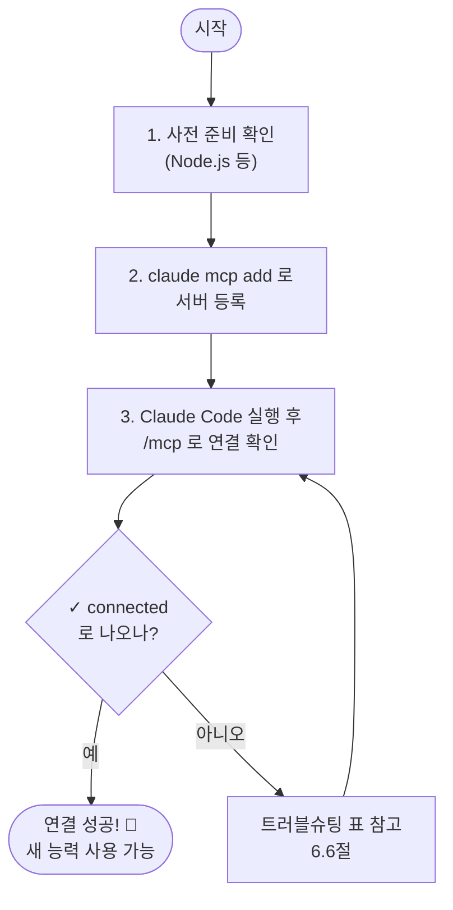

# 챕터 6: 일상 업무를 자동화하기 — 슬래시 명령·MCP·외부 도구 연결

## 이 챕터에서 배울 것

지금까지 우리는 AI에게 매번 "이거 해줘, 저거 해줘"라고 말로 부탁해 왔습니다. 그런데 똑같은 부탁을 매일, 매주 반복하고 있다면 어떨까요? "주간 보고서 형식 그대로 만들어줘"를 월요일마다 길게 타이핑하는 건 좀 아깝지 않나요?

이 챕터를 끝까지 따라 하면, 여러분은 두 가지를 손에 넣게 됩니다.

첫째, **자주 쓰는 부탁을 한 단어로 줄이는 법** — 긴 지시를 `/주간보고` 같은 슬래시 명령 하나로 묶습니다.

둘째, **AI에게 손과 발을 달아주는 법** — MCP라는 기술로 Claude Code를 웹 브라우저, 외부 문서 도구, 데이터베이스 같은 바깥 세계와 연결합니다.

이 챕터가 끝나면 여러분의 Claude Code는 "대화만 하는 AI"에서 "내 도구들을 직접 다루는 AI"로 한 단계 올라섭니다.

> **이 챕터의 난이도:** 슬래시 명령은 쉽습니다(파일 하나 만들면 끝). MCP는 이 책에서 처음으로 "설정"이라는 걸 다루기 때문에 조금 더 까다롭게 느껴질 수 있어요. 그래서 **쉬운 것(슬래시 명령) → 어려운 것(MCP)** 순서로 천천히 올라갑니다. 작은 성공을 먼저 맛본 뒤 큰 도전으로 넘어가는 구성입니다.

---

## 6.1 같은 부탁을 매번 다시 타이핑하고 있나요?

먼저 우리가 풀려는 문제를 분명히 해봅시다.

여러분이 매주 월요일에 Claude Code에게 이렇게 부탁한다고 가정해볼게요.

```
지난 한 주 동안 work 폴더에서 변경된 파일들을 살펴보고,
무엇을 작업했는지 3줄로 요약한 다음, "이번 주 한 일 / 다음 주 할 일 /
막힌 점" 세 항목으로 정리해서 weekly.md 파일에 저장해줘.
```

좋은 요청입니다. 챕터 2에서 배운 "맥락 → 목표 → 제약"이 잘 들어가 있죠. 문제는 **이걸 매주 똑같이 타이핑해야 한다**는 거예요. 한 글자라도 빠뜨리면 결과가 달라지고요.

이럴 때 쓰는 것이 **슬래시 명령(커스텀 커맨드)** 입니다. 위의 긴 부탁을 파일 하나에 저장해두면, 다음부터는 이렇게만 입력하면 됩니다.

```
/주간보고
```

긴 지시 전체가 자동으로 펼쳐져서 실행됩니다. 마치 전화기에 단축번호를 등록해두는 것과 같아요. 매번 11자리 번호를 누르는 대신 단축번호 1번만 누르면 되는 거죠.

> **슬래시 명령이란?** 자주 쓰는 지시문을 미리 저장해두고, `/이름` 한 줄로 불러 쓰는 나만의 단축 명령입니다. 이미 여러분은 `/exit`(종료)나 `/help`(도움말) 같은 기본 슬래시 명령을 써봤습니다. 이번엔 그걸 **직접 만드는** 겁니다.

*긴 지시를 슬래시 명령 하나로 압축하기*

```
[전]  매주 월요일                       [후]  매주 월요일
                                              
  나 ──"지난 한 주 동안 work          나 ──"/주간보고"──▶ Claude Code
       폴더에서 변경된 파일을              (한 줄!)         │
       살펴보고... (5줄 더)"                              ▼
            │                                      저장된 긴 지시가
            ▼                                       자동으로 펼쳐져 실행
       Claude Code 실행
```

---

## 6.2 첫 슬래시 명령 만들기

슬래시 명령은 **마크다운 파일(.md) 하나**로 만듭니다. 그 파일에 적힌 내용이 곧 "AI에게 전달될 지시문"이 됩니다.

파일을 어디에 두느냐에 따라 명령의 적용 범위가 달라집니다. 두 곳을 기억하세요.

| 두는 위치 | 경로 | 언제 쓰나 |
|-----------|------|-----------|
| **프로젝트 범위** | `프로젝트폴더/.claude/commands/` | 이 프로젝트에서만 쓰는 명령 (팀과 공유 가능) |
| **사용자 범위** | `~/.claude/commands/` | 내 모든 프로젝트에서 쓰는 개인 명령 |

`.claude/commands/주간보고.md` 라는 파일을 만들면 → `/주간보고` 명령이 생깁니다. **파일 이름이 곧 명령 이름**이 되는 아주 단순한 규칙이에요.

가장 좋은 점: 이 파일조차 **Claude Code에게 만들어달라고 하면 됩니다.** 우리는 손으로 파일을 짤 필요가 없어요. 평소처럼 말로 부탁하면 됩니다.

---

### 실습 6-1: `/주간보고` 슬래시 명령 등록하기

Claude Code를 실행한 상태에서, 아래처럼 부탁해보세요.

```
.claude/commands/주간보고.md 라는 슬래시 명령 파일을 만들어줘.
내용은 이렇게 해줘: "지난 한 주 동안 이 폴더에서 변경된 파일들을
살펴보고, 무엇을 작업했는지 3줄로 요약한 다음, '이번 주 한 일 /
다음 주 할 일 / 막힌 점' 세 항목으로 정리해서 weekly.md 파일에
저장해줘."
```

Claude Code가 파일을 만들어줍니다.

```
I'll create the slash command file for you.

● Write(.claude/commands/주간보고.md)
  ⎿ 지난 한 주 동안 이 폴더에서 변경된 파일들을 살펴보고,
    무엇을 작업했는지 3줄로 요약한 다음, "이번 주 한 일 /
    다음 주 할 일 / 막힌 점" 세 항목으로 정리해서
    weekly.md 파일에 저장해줘.

✓ Done
```

만들어진 파일 내용은 이렇게 아주 단순합니다. 특별한 문법이 없어요. 그냥 **여러분이 평소에 하던 부탁을 그대로 적어둔 것**입니다.

*`.claude/commands/주간보고.md` 파일 내용*

```markdown
지난 한 주 동안 이 폴더에서 변경된 파일들을 살펴보고,
무엇을 작업했는지 3줄로 요약한 다음, "이번 주 한 일 /
다음 주 할 일 / 막힌 점" 세 항목으로 정리해서
weekly.md 파일에 저장해줘.
```

이제 새로 만든 명령을 써봅시다. 프롬프트에 슬래시를 입력하면 방금 만든 명령이 목록에 보입니다.

```
> /주간보고
```

**이렇게 나오면 성공!** 긴 지시가 자동으로 펼쳐져 실행됩니다.

```
> /주간보고

(저장된 지시문이 그대로 실행됩니다)

● Read(.) — 폴더의 최근 변경 파일 확인
● 작업 요약 작성 중...

● Write(weekly.md)
  ⎿ ## 이번 주 한 일
    - 보고서 자동화 슬래시 명령 작성
    - work 폴더 파일 3건 정리
    ...

✓ weekly.md 저장 완료
```

`/주간보고` 한 줄이 그 긴 부탁을 통째로 대신했습니다. 다음 주 월요일엔 이 한 줄만 치면 됩니다.

---

### 슬래시 명령에 빈칸 만들기 — `$ARGUMENTS`

방금 만든 명령은 항상 똑같이 동작합니다. 그런데 "매번 조금씩 달라지는 부분"을 넣고 싶을 때가 있어요. 예를 들어 "특정 주제로 회의록을 정리"하는 명령이라면, 주제는 그때그때 바뀌겠죠.

이럴 때 지시문 안에 **`$ARGUMENTS`** 라는 빈칸을 넣어둡니다. 명령을 부를 때 뒤에 적은 내용이 그 빈칸에 쏙 들어갑니다.

*`.claude/commands/회의록.md` 파일 내용*

```markdown
$ARGUMENTS 주제로 진행한 회의 메모를 정리해줘.
"결정사항 / 할 일(담당자 포함) / 다음 회의 안건" 세 항목으로
깔끔하게 마크다운 표를 만들어서 meeting.md 에 저장해줘.
```

이제 이렇게 부르면:

```
> /회의록 신제품 출시 일정
```

`$ARGUMENTS` 자리에 `신제품 출시 일정`이 들어가서, 마치 "신제품 출시 일정 주제로 진행한 회의 메모를..."라고 부탁한 것과 똑같이 동작합니다.

> **참고:** 인자를 여러 개 받아 위치별로 골라 쓰고 싶다면 `$ARGUMENTS[0]`(첫 번째 인자), `$ARGUMENTS[1]`(두 번째 인자)처럼 0부터 시작하는 번호로 지정할 수도 있습니다. 입문 단계에서는 `$ARGUMENTS` 하나면 충분합니다.

---

스스로 해보기: 여러분이 **매주 또는 매일 반복하는 부탁**을 하나 떠올려 보세요. (예: "오늘 한 일 일기로 정리", "이 폴더 파일들 이름 규칙 통일") 그걸 Claude Code에게 `.claude/commands/내명령.md` 파일로 만들어달라고 부탁하고, 슬래시로 직접 호출해보세요. 이 챕터에서 가장 중요한 실습입니다 — 여러분의 실제 업무 하나가 한 단어로 줄어드는 경험을 꼭 해보세요.

---

여기까지가 "작은 성공"입니다. 슬래시 명령은 파일 하나면 끝났죠. 이제 한 단계 큰 도전으로 넘어갑니다. AI를 **내 컴퓨터 밖의 도구들**과 연결하는 일, MCP입니다.

---

## 6.3 MCP — AI에게 손과 발을 달아주기

지금까지 Claude Code가 할 수 있었던 일을 떠올려 보세요. 파일을 읽고, 쓰고, 고치고, 폴더를 정리하고, 코드를 실행했습니다. 전부 **여러분 컴퓨터 안의 파일** 작업이었어요.

하지만 이런 부탁은 못 했습니다.

- "이 웹사이트에 직접 들어가서 화면에 뭐가 보이는지 확인해줘"
- "우리 데이터베이스에서 이번 달 매출 합계를 가져와줘"
- "내 이슈 트래커에서 ENG-451 작업 내용 보고 코드 고쳐줘"

왜 못 했을까요? Claude Code에게는 **브라우저를 조작할 손도, 데이터베이스에 접속할 발도 없었기 때문**입니다. 자기 컴퓨터의 파일까지가 그가 닿을 수 있는 세계의 전부였어요.

> **MCP를 한 문장으로:** MCP(Model Context Protocol)는 **AI에게 손과 발을 달아주는 일**입니다. 브라우저라는 손, 데이터베이스라는 발, 문서 도구라는 또 다른 손 — 이런 외부 도구를 Claude Code에 끼워 넣어 "직접 다룰 수 있게" 만드는 표준 규격이에요.

비유를 좀 더 밀어볼게요. 지금까지의 Claude Code는 **책상 앞에만 앉아 있는 비서**였습니다. 책상 위 서류(파일)는 자유자재로 다루지만, 자리에서 일어나 옆방 캐비닛(데이터베이스)을 열거나 밖에 나가 게시판(웹사이트)을 확인할 수는 없었죠.

MCP는 이 비서에게 **"옆방 캐비닛 열쇠"** 와 **"외출 허가증"** 을 하나씩 쥐여주는 일입니다. 열쇠(MCP 서버)를 하나 줄 때마다 비서가 다룰 수 있는 도구가 하나씩 늘어납니다.

*MCP가 Claude Code의 활동 범위를 넓히는 방식*

```
        [MCP 없을 때]                      [MCP 연결 후]

      ┌─────────────┐                  ┌─────────────┐
      │ Claude Code │                  │ Claude Code │
      └──────┬──────┘                  └──────┬──────┘
             │                                │
        내 컴퓨터 파일             ┌──────────┼──────────┐
        (읽기/쓰기/수정)          │          │          │
                              내 파일     웹 브라우저   데이터/문서
                                       (MCP 서버)   (MCP 서버)
                                       = 새로 달린 손과 발
```

여기서 자주 나오는 두 단어를 정리하고 넘어갑시다.

- **MCP 서버:** AI에게 달아줄 "손과 발" 하나하나. 브라우저 제어 서버, 데이터베이스 서버처럼 기능별로 존재합니다. 우리는 이걸 **연결(설치)** 합니다.
- **MCP 클라이언트:** 그 손발을 실제로 부리는 쪽. 여기서는 **Claude Code 자신**이 클라이언트입니다.

즉 우리가 할 일은 단 하나예요. **필요한 MCP 서버를 Claude Code에 연결하는 것.** 그러면 그 서버가 제공하는 능력(도구)이 Claude Code의 능력에 더해집니다.

> ⚠️ **보안 경고 — 반드시 읽으세요**
>
> MCP 서버는 AI에게 새로운 능력을 주는 만큼, **신뢰할 수 있는 서버만 연결해야 합니다.** 출처가 불분명한 MCP 서버는 여러분의 파일을 외부로 빼돌리거나, 악의적인 지시를 AI에게 몰래 주입할 수 있습니다(이를 '프롬프트 인젝션'이라 합니다).
>
> 원칙은 간단합니다: **공식 문서나 Anthropic 디렉터리(claude.ai/directory)에 등재된, 만든 곳이 분명한 서버만 연결하세요.** 낯선 곳에서 복붙한 설정은 절대 그대로 실행하지 마세요. 이건 "모르는 사람이 준 USB를 회사 컴퓨터에 꽂지 않는다"와 똑같은 상식입니다.

---

## 6.4 "왜 좋은지" 먼저 — 브라우저를 연결한 Claude Code

설정 방법을 배우기 전에, **연결하면 뭐가 좋아지는지** 부터 봅시다. 동기가 있어야 까다로운 설정도 견딜 만하니까요.

우리가 이 챕터에서 실제로 연결해볼 서버는 **Playwright MCP 서버**입니다. 이름이 어려워 보이지만, 하는 일은 단순합니다. **Claude Code가 진짜 웹 브라우저를 직접 열고 조작할 수 있게** 해줍니다. 페이지를 열고, 화면을 보고, 버튼을 누르고, 내용을 읽어옵니다.

> **왜 이 서버를 골랐나:** Playwright는 마이크로소프트가 만든 잘 알려진 브라우저 자동화 도구이고, 그 공식 MCP 서버(`@playwright/mcp`)는 Anthropic 공식 문서에서도 소개되는 검증된 서버라 입문 실습으로 안전합니다. *(주의: MCP 생태계는 빠르게 바뀝니다. 서버 이름이나 설치 명령은 시간이 지나면 달라질 수 있으니, 막히면 항상 공식 문서 `code.claude.com/docs/en/mcp` 와 해당 서버의 README를 확인하세요.)*

연결이 끝났다고 가정하고, 미리 결과부터 보겠습니다. 연결 후에는 이런 부탁이 가능해집니다.

```
> example.com 사이트를 브라우저로 열어서 페이지에 어떤 내용이
  적혀 있는지 요약해줘.
```

Claude Code가 **실제 브라우저를 띄워** 페이지를 열고, 내용을 읽어 답합니다.

```
● playwright - browser_navigate (https://example.com)
  ⎿ 페이지 로드 완료

● playwright - browser_snapshot
  ⎿ 페이지 내용을 읽었습니다

이 페이지는 "Example Domain"이라는 제목의 안내 페이지입니다.
별도의 가입이나 설정 없이 예시·문서용으로 쓰라고 마련된
도메인이며, 본문에는 더 자세한 정보를 보려면 링크를 따라가라는
안내가 있습니다.
```

보이시나요? `Read`나 `Write` 대신 **`playwright - browser_navigate`** 라는 새로운 동작이 등장했습니다. 이게 바로 방금 달아준 "손"입니다. 원래 Claude Code에는 없던 능력이에요.

이제 이 능력을 어떻게 손에 넣는지, 연결 과정을 보겠습니다.

---

## 6.5 MCP 서버 연결하기 — 기본 흐름 한 번에 이해하기

MCP 연결은 겁먹을 필요 없습니다. 핵심은 **명령어 한 줄**입니다. 설정 파일을 손으로 짜지 않아도 돼요. `claude mcp add`라는 명령이 알아서 설정을 만들어줍니다.

전체 흐름은 이렇습니다.

*MCP 서버 연결 4단계*



> **중요 — 이 명령은 어디에 입력하나요?** `claude mcp add ...` 는 Claude Code **안의 `>` 프롬프트가 아니라**, 평범한 **터미널(PowerShell / 터미널)** 에 입력합니다. 챕터 1에서 `claude --version`을 쳤던 바로 그 자리예요. Claude Code 대화 창과 헷갈리지 마세요.

---

### 실습 6-2: Playwright MCP 서버 연결하기

**Step 0: 사전 준비 (Node.js 확인)**

이 서버는 `npx`라는 도구로 실행됩니다. `npx`는 Node.js에 딸려 옵니다. 터미널에 아래를 입력해 설치 여부를 확인하세요.

```
node --version
```

`v20.x.x` 같은 버전 번호가 나오면 준비 완료입니다. `명령을 찾을 수 없음` 류의 오류가 나오면 Node.js부터 설치해야 합니다(`nodejs.org`에서 LTS 버전 설치). 한 번만 해두면 됩니다.

**Step 1: 서버 등록 (터미널에서)**

이제 핵심 한 줄입니다. 터미널(Claude Code 밖)에 아래를 그대로 입력하세요.

```
claude mcp add playwright -- npx -y @playwright/mcp@latest
```

한 줄을 뜯어보면 이렇습니다. 외울 필요는 없고 구조만 눈에 익히세요.

```
claude mcp add  playwright  --  npx -y @playwright/mcp@latest
└──────┬─────┘  └───┬────┘  ┬   └──────────┬─────────────┘
   서버 추가 명령   내가 붙일   ↑      이 서버를 실제로 실행하는 명령
                  서버 이름   │
                            이 앞은 Claude 옵션,
                            이 뒤는 서버 실행 명령 (구분선)
```

> **`--`(대시 두 개)가 왜 있나요?** 앞쪽은 Claude Code에게 주는 옵션이고, 뒤쪽은 "이 서버를 켤 때 실제로 실행할 명령"입니다. `--`가 둘 사이의 칸막이 역할을 합니다. 이게 없으면 Claude Code가 뒤의 명령을 자기 옵션으로 착각할 수 있어요. **그냥 형식이라고 받아들이고 넘어가도 됩니다.**

입력하면 이렇게 등록 완료 메시지가 나옵니다.

```
Added stdio MCP server playwright with command:
npx -y @playwright/mcp@latest to local config
```

> **범위(scope) 참고:** 위 명령은 기본값인 **현재 프로젝트(local)** 에만 서버를 등록합니다. local 범위는 `~/.claude.json`에 저장되며, 프로젝트 폴더에 `.mcp.json` 파일을 만들지 않습니다. 프로젝트 폴더에서 `.mcp.json`을 찾아도 없는 게 정상입니다. 모든 프로젝트에서 쓰고 싶다면 끝에 `--scope user`를 붙이세요. (범위 이야기는 6.7절에서 자세히 다룹니다.)

**Step 2: 등록됐는지 목록으로 확인 (터미널에서)**

```
claude mcp list
```

방금 추가한 서버가 목록에 보이면 됩니다.

```
playwright: npx -y @playwright/mcp@latest - ✓ Connected
```

**Step 3: Claude Code 안에서 최종 확인**

이제 Claude Code를 실행하고(`claude`), 대화 프롬프트에 `/mcp`를 입력하세요.

```
> /mcp
```

**이렇게 나오면 성공!**

```
MCP Servers

  playwright   ✓ connected   (21 tools)

서버를 선택하면 상세 정보와 인증 옵션을 볼 수 있습니다.
```

`✓ connected`와 함께 서버 이름이 보이면 연결 성공입니다! 옆의 `(21 tools)`는 이 서버가 Claude Code에게 새로 달아준 능력(도구)의 개수예요. 숫자는 버전에 따라 다를 수 있습니다.

이제 6.4절에서 미리 봤던 그 부탁을 진짜로 해볼 수 있습니다.

```
> example.com 을 브라우저로 열어서 내용을 한 줄로 요약해줘.
```

Claude Code가 브라우저를 띄워 페이지를 열고 요약해주면 — **여러분은 방금 AI에게 손 하나를 달아준 겁니다.**

> **첫 실행은 조금 느릴 수 있어요.** Playwright가 처음 한 번은 브라우저 구성요소를 내려받기 때문입니다. 권한을 묻는 화면이 뜨면 챕터 3에서 배운 대로 내용을 확인하고 승인하세요.

---

## 6.6 연결이 안 될 때 — 미니 트러블슈팅

MCP는 처음에 한 번에 안 되는 경우가 흔합니다. 당황하지 마세요. 대부분 아래 표의 순서대로 짚으면 해결됩니다. **위에서부터 차례로** 점검하는 게 요령입니다.

*MCP 연결 실패 점검 순서*

| 증상 | 점검할 것 | 해결 방법 |
|------|-----------|-----------|
| `/mcp`에 서버가 아예 안 보임 | 등록이 됐나? | 터미널에서 `claude mcp list`로 확인. 없으면 `claude mcp add` 다시 실행 |
| 등록은 됐는데 `failed`로 표시 | 사전 준비(Node.js) | 터미널에서 `node --version` 확인. 없으면 Node.js LTS 설치 |
| 방금 추가했는데 반영 안 됨 | 재시작 | Claude Code를 `/exit`로 완전히 끄고 다시 `claude` 실행 |
| `connecting...`에서 안 넘어감 | 첫 다운로드 대기 | 첫 실행은 구성요소 내려받느라 느립니다. 1~2분 기다린 뒤 다시 `/mcp` |
| 도구를 쓰려는데 권한 거부 | 권한 승인 | 권한 요청 화면이 뜨면 승인. 거부했다면 다시 부탁해 승인 |
| 엉뚱한 프로젝트라 안 보임 | 범위(scope) | 다른 폴더에서 등록한 건 아닌지 확인. 전역으로 쓰려면 `--scope user`로 재등록 |

이 표로도 안 되면, 가장 확실한 마지막 카드는 이것입니다. **Claude Code에게 직접 물어보세요.**

```
> /mcp 에서 playwright 서버가 failed 로 나와. 원인이 뭘지,
  어떻게 고치면 될지 단계별로 알려줘.
```

AI는 자기 자신의 MCP 상태를 점검하고 해결책을 안내하는 데 능숙합니다. 막혔을 때 가장 빠른 길일 때가 많아요.

---

## 6.7 설정을 재사용·공유하기 — 프로젝트 범위 vs 사용자 범위

이제 슬래시 명령과 MCP 서버를 만들 줄 압니다. 마지막 질문은 이거예요. **이 설정들을 어디까지 적용할 것인가?**

핵심 개념은 단 둘입니다. **프로젝트 범위**와 **사용자 범위**.

| 범위 | 적용 대상 | 저장 위치 | 팀 공유 |
|------|-----------|-----------|---------|
| **프로젝트 범위** | 이 프로젝트에서만 | 슬래시 명령: `프로젝트/.claude/commands/`<br/>MCP: `프로젝트/.mcp.json` | ✅ 가능 (저장소에 함께 올림) |
| **사용자 범위** | 내 모든 프로젝트에서 | 슬래시 명령: `~/.claude/commands/`<br/>MCP: `~/.claude.json` | ❌ 내 컴퓨터에만 |

쉽게 구분하는 기준은 이렇습니다.

- **"우리 팀 모두가, 이 프로젝트에서 똑같이 써야 한다"** → 프로젝트 범위. 설정을 프로젝트 폴더 안에 두면, 저장소(Git)에 함께 올려 팀원과 공유할 수 있습니다. 동료가 프로젝트를 받으면 똑같은 `/주간보고` 명령과 똑같은 MCP 서버를 그대로 쓰게 돼요.
- **"이건 내 개인 습관이라, 내가 하는 모든 작업에서 쓰고 싶다"** → 사용자 범위. 내 컴퓨터 홈 폴더에 두면 프로젝트를 옮겨 다녀도 항상 따라옵니다.

*같은 설정, 다른 적용 범위*

```
[사용자 범위]  ~/.claude/                  ← 내 모든 프로젝트에 적용
                 └ commands/일기.md           (나만, 어디서나)

[프로젝트 범위]  내프로젝트/.claude/         ← 이 프로젝트에만 적용
                   └ commands/주간보고.md      (팀 전체, 저장소로 공유)
                 내프로젝트/.mcp.json          ← 프로젝트 MCP 설정
```

MCP 서버를 사용자 범위로 등록하려면, 6.5절 명령 끝에 `--scope user`만 붙이면 됩니다.

```
claude mcp add playwright --scope user -- npx -y @playwright/mcp@latest
```

> **팀 공유의 묘미:** 프로젝트 범위로 MCP를 추가하면 프로젝트 루트에 `.mcp.json` 파일이 생깁니다. 이 파일을 저장소에 커밋해두면, 동료가 프로젝트를 내려받았을 때 똑같은 도구 환경을 그대로 물려받습니다. 단, 안전을 위해 Claude Code는 프로젝트에 딸려온 MCP 서버를 처음 쓸 때 **"이 서버를 신뢰하느냐"** 고 한 번 물어봅니다 — 6.3절의 보안 경고가 여기서도 작동하는 거예요. (이 팀 공유·운영 이야기는 챕터 8에서 본격적으로 다룹니다.)

---

스스로 해보기: 6.2절에서 만든 여러분의 개인 슬래시 명령을 **사용자 범위**(`~/.claude/commands/`)로 옮겨보세요. Claude Code에게 "이 명령을 모든 프로젝트에서 쓸 수 있게 사용자 범위로 옮겨줘"라고 부탁하면 됩니다. 옮긴 뒤 **다른 폴더로 이동해서** `claude`를 실행하고, 그 명령이 거기서도 보이는지 확인해보세요.

---

## 이 챕터에서 배운 것

- **슬래시 명령**은 자주 쓰는 긴 부탁을 `.claude/commands/이름.md` 파일에 저장해 `/이름` 한 줄로 부르는 나만의 단축 명령이다
- 슬래시 명령 파일은 특별한 문법 없이 **평소 하던 부탁을 그대로 적으면** 된다 — 파일조차 AI에게 만들어달라고 하면 된다
- 지시문에 **`$ARGUMENTS`** 빈칸을 넣으면 호출할 때 값을 바꿔 넣을 수 있다
- **MCP**는 AI에게 **손과 발을 달아주는 일** — 브라우저, 데이터베이스, 문서 도구 같은 외부 도구를 Claude Code에 연결하는 표준이다
- MCP 서버 연결은 설정 파일을 손으로 짜는 게 아니라 터미널에서 **`claude mcp add 이름 -- 실행명령`** 한 줄로 한다
- 연결 확인은 Claude Code 안에서 **`/mcp`** → **`✓ connected`** 가 보이면 성공이다
- 연결이 안 되면 **등록 → 사전 준비(Node.js) → 재시작 → 권한 → 범위** 순서로 점검한다 (막히면 AI에게 직접 물어보는 게 빠르다)
- 설정은 **프로젝트 범위**(팀과 공유)와 **사용자 범위**(내 모든 프로젝트)로 나눠 재사용한다
- **신뢰할 수 있는 출처의 MCP 서버만** 연결한다 — 보안은 타협하지 않는다

## 다음 챕터 예고

지금까지 우리는 "AI를 잘 쓰는 사람"이 되는 길을 걸어왔습니다. 슬래시 명령으로 반복을 줄이고, MCP로 도구를 확장했죠.

다음 챕터(심화)에서는 한 걸음 더 나아갑니다. 이제 여러분은 **AI를 쓰는 사람을 넘어, AI 팀을 설계하는 사람**이 됩니다. 여러 전문 에이전트에게 역할을 나눠 일을 위임하고(서브에이전트), 특정 시점에 검토·테스트가 자동으로 흐르도록 만드는(훅) 방법을 배웁니다. 흥미롭게도, **바로 이 책을 집필한 시스템 자체**가 그렇게 만들어진 AI 팀이었습니다. 그 무대 뒤를 함께 열어보겠습니다.
