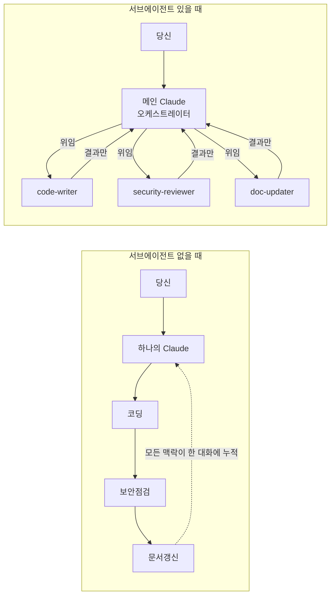
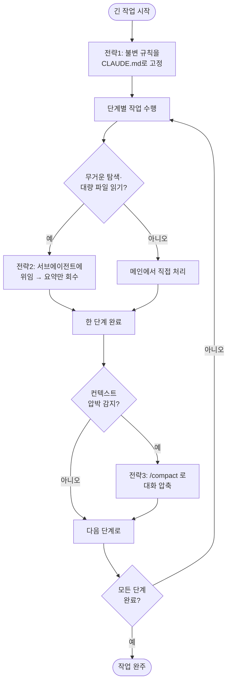
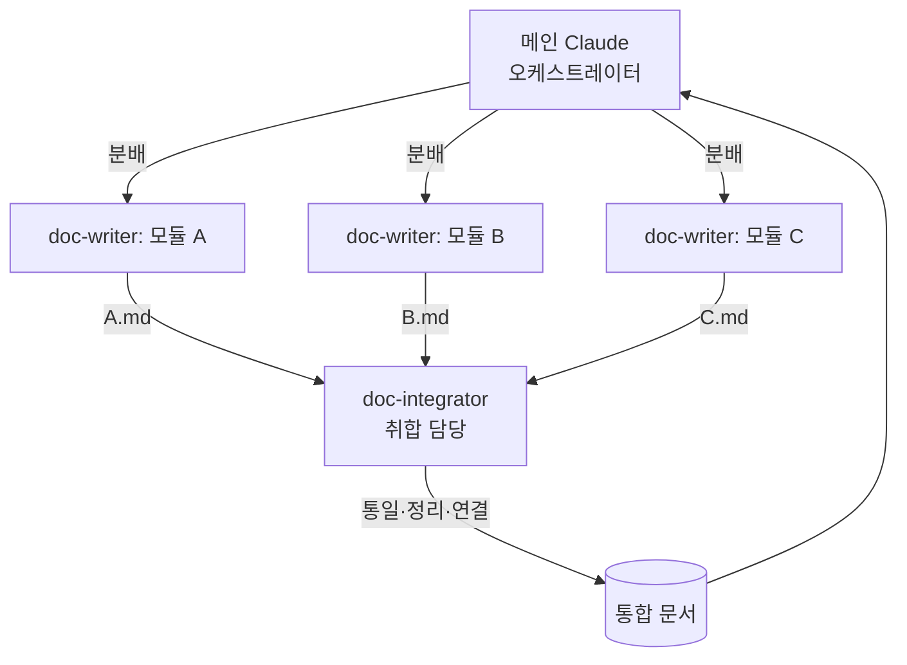

# 챕터 7: AI 협업을 설계하는 사람 — 서브에이전트·훅·워크플로 자동화

## 이 챕터에서 배울 것

지금까지 여러분은 AI에게 일을 시키는 사람이었습니다. "이 파일 고쳐줘", "이 기능 추가해줘"라고 요청하면, 한 명의 Claude가 처음부터 끝까지 그 일을 처리했죠.

이 챕터를 끝까지 읽고 나면, 여러분의 위치가 한 단계 올라갑니다. 더 이상 AI에게 매번 직접 지시하는 사람이 아니라, **여러 AI를 어떻게 배치하고 무엇을 자동으로 흐르게 할지 설계하는 사람**이 됩니다.

구체적으로는 이런 것을 할 수 있게 됩니다.

- 일을 역할별로 쪼개서 **전문 에이전트(서브에이전트)** 에게 위임하기
- 특정 시점마다 자동으로 실행되는 **훅(Hook)** 으로, 검토·포맷·테스트를 사람 손 없이 흐르게 하기
- 긴 작업에서 맥락이 흐트러지지 않도록 **컨텍스트를 관리**하기
- 서로 독립적인 일을 **여러 에이전트가 동시에** 처리하게 만들기
- 이렇게 만든 작업 방식을 **스킬·명령으로 패키징**해 다음에도, 동료에게도 그대로 재사용하기

그리고 이 모든 것을 설명하는 데 특별한 교보재가 필요하지 않습니다. **지금 여러분이 읽고 있는 이 책 자체가, 5개의 AI 에이전트로 구성된 협업 시스템이 집필하고 있기 때문**입니다. 추상적인 개념이 나올 때마다, 이 책을 만든 실제 시스템을 열어 보여드리겠습니다.

> **레벨 안내:** 이 챕터는 심화 과정입니다. 챕터 5(코드베이스 작업)와 챕터 6(슬래시 명령·MCP)을 거쳤다고 가정하지만, 건너뛴 분을 위해 바로 다음 절에서 핵심만 한 페이지로 요약합니다.

---

## 7.1 여기까지 온 길 — 챕터 5·6 한 페이지 요약

본격적으로 들어가기 전에, 이 챕터가 딛고 서 있는 두 챕터의 핵심을 짧게 짚겠습니다. 이미 읽으셨다면 복습으로, 건너뛰셨다면 안전망으로 사용하세요.

**챕터 5에서 배운 것 — 맥락을 주는 능력이 실력이 된다**

- AI에게 프로젝트 전체를 탐색·요약시켜 큰 코드베이스를 파악하게 할 수 있다
- 큰 변경은 **Plan(계획)을 먼저 받고** 단계별로 승인하며 안전하게 진행한다
- `CLAUDE.md` 파일에 프로젝트 규칙·맥락을 적어두면, AI가 매 대화에서 그것을 영구적으로 기억한다

**챕터 6에서 배운 것 — 반복을 묶고 도구를 확장한다**

- 자주 쓰는 작업을 **슬래시 명령**(`/주간보고` 같은 커스텀 커맨드)으로 등록해 한 단어로 호출한다
- **MCP(Model Context Protocol)** 로 외부 도구(브라우저, 문서, 데이터 소스)를 Claude Code에 연결해 "손과 발"을 달아준다
- 설정은 **프로젝트 범위**(그 폴더에서만)와 **사용자 범위**(모든 프로젝트에서)로 나눠 재사용·공유한다

이번 챕터는 이 두 흐름을 하나로 합칩니다. 챕터 5의 `CLAUDE.md`(맥락 기억)와 챕터 6의 슬래시 명령(작업 묶기)을, 이제 **여러 에이전트와 자동 트리거**로 확장합니다. 핵심 전환은 이것입니다.

> 챕터 6까지: "내가 AI에게 무엇을 시킬까"
> 챕터 7부터: "AI들이 서로에게 무엇을 시키게 만들까"

---

## 7.2 한 명의 만능 일꾼에서 전문가 팀으로 — 서브에이전트

### 용어부터 못 박기

새 개념이 쏟아지는 챕터이므로, 헷갈리는 용어는 먼저 정의 박스로 고정하고 진행하겠습니다.

> **정의 — 서브에이전트(Subagent)**
> 메인 Claude가 특정 작업을 **위임**할 수 있는, 별도의 역할과 별도의 대화 맥락을 가진 보조 AI. 자신만의 시스템 프롬프트(역할 지시)와 사용 가능한 도구 목록을 가진다. 메인 Claude는 서브에이전트에게 일을 맡기고, 그 **결과만** 돌려받는다. 서브에이전트가 일하는 동안 주고받은 수많은 중간 대화는 메인 쪽으로 넘어오지 않는다.

> **정의 — 메인 에이전트(Main agent) / 오케스트레이터(Orchestrator)**
> 여러분이 직접 대화하는 Claude. 전체 작업을 조율하고, 어떤 일을 누구에게 위임할지 결정한다. 팀으로 치면 일을 나눠주는 팀장에 해당한다.

> **정의 — 시스템 프롬프트(System prompt)**
> 에이전트에게 "너는 누구이고 무슨 일을 하는 사람이다"를 알려주는 역할 지시문. 에이전트 정의 파일의 본문이 곧 이 역할 지시가 된다.

### 이게 없을 때 vs 있을 때

서브에이전트가 왜 필요한지는, 없을 때와 있을 때를 나란히 놓고 보면 분명해집니다.

**서브에이전트가 없을 때 (한 명이 다 하기)**

```
당신: "이 결제 모듈에 환불 기능 추가하고, 보안 점검도 하고,
       끝나면 변경 사항 문서도 갱신해줘"

  하나의 Claude가 순서대로:
  1. 환불 기능을 짠다 (코드 작성 맥락이 대화에 쌓임)
  2. 그 상태 그대로 보안 점검을 한다 (코드 작성 맥락이 시야를 가림)
  3. 그 상태 그대로 문서를 고친다 (앞의 두 작업 잔재가 계속 끼어듦)
```

문제는 두 가지입니다. 첫째, **한 맥락에 모든 것이 뒤섞입니다.** 코드를 짜던 사고방식 그대로 보안을 점검하면, 방금 자기가 짠 코드를 객관적으로 의심하기 어렵습니다. 둘째, **대화가 비대해집니다.** 환불 기능을 짜며 읽은 파일, 시도한 코드, 수정 내역이 전부 대화에 남아, 문서를 고칠 때쯤이면 정작 중요한 정보가 잡동사니에 묻힙니다.

**서브에이전트가 있을 때 (역할을 나눠 위임)**

```
당신: (같은 요청)

  메인 Claude(오케스트레이터)가 일을 나눈다:
  ├─▶ code-writer 에이전트   → 환불 기능 구현 (자기만의 깨끗한 맥락)
  ├─▶ security-reviewer 에이전트 → 결과 코드만 받아 보안 점검 (의심하는 시각 전담)
  └─▶ doc-updater 에이전트   → 변경분만 받아 문서 갱신 (문서 작업에만 집중)

  각 에이전트는 자기 일만 하고, 메인에게 "결과 요약"만 돌려준다.
```

차이가 보이시나요. 보안 점검을 맡은 에이전트는 "나는 이 코드를 의심하는 사람"이라는 역할만 부여받았기에, 작성자의 편향 없이 코드를 봅니다. 그리고 각자 자기 맥락에서 일하므로, 메인의 대화는 깔끔하게 유지됩니다.

> **핵심 비유:** 서브에이전트는 "탭을 늘리는 일"이 아니라 "직원을 뽑는 일"입니다. 같은 사람에게 일을 더 시키는 게 아니라, 그 일에 맞는 다른 전문가에게 맡기는 것입니다.

*한 명이 순차 처리할 때와 팀이 위임 처리할 때의 흐름 차이*



### 서브에이전트는 어디에 정의하는가

서브에이전트는 프로젝트 안의 정해진 폴더에 **마크다운 파일 하나**로 정의합니다. 파일을 만들면 그 자체가 한 명의 에이전트가 됩니다.

```
프로젝트루트/
└── .claude/
    └── agents/
        ├── code-writer.md          ← 에이전트 1명
        ├── security-reviewer.md    ← 에이전트 1명
        └── doc-updater.md          ← 에이전트 1명
```

이것이 챕터 5의 `CLAUDE.md`, 챕터 6의 슬래시 명령과 같은 원리입니다. **특정 위치에 특정 형식의 파일을 두면, Claude Code가 그것을 읽어 기능으로 인식**합니다. 서브에이전트는 그 대상이 "역할을 가진 보조 AI"일 뿐입니다.

> **프로젝트 범위 vs 사용자 범위 (챕터 6 복습)**
> `.claude/agents/`(프로젝트 루트)에 두면 그 프로젝트에서만, `~/.claude/agents/`(홈 폴더)에 두면 모든 프로젝트에서 그 에이전트를 쓸 수 있습니다. 팀과 공유할 에이전트는 프로젝트 범위에 두고 저장소에 커밋합니다.

### 살아있는 사례: 이 책을 쓰는 5명의 에이전트

이제 약속한 실제 사례를 열어보겠습니다. 지금 읽고 계신 이 책은 다음 5개의 에이전트로 구성된 팀이 집필합니다. 폴더를 그대로 보여드리면 이렇습니다.

```
01_book/
└── .claude/
    └── agents/
        ├── curriculum-designer.md   ← 커리큘럼·목차 설계 담당
        ├── content-writer.md        ← 챕터 본문 집필 담당 (지금 이 글을 쓰는 에이전트)
        ├── example-creator.md       ← 예제 코드·실습 과제 담당
        ├── visual-designer.md       ← 다이어그램·표 등 시각화 담당
        └── editor-reviewer.md       ← 품질 검토·편집 담당
```

각 파일의 첫머리에는 그 에이전트의 **역할 정의**가 적혀 있습니다. 예를 들어 방금 이 글을 쓰고 있는 `content-writer.md`의 핵심 부분은 이렇습니다.

```markdown
# Content Writer

## 핵심 역할
curriculum-designer가 설계한 챕터 명세를 바탕으로 실제 책 본문을
집필한다. 독자가 Claude Code를 처음 접하는 사람부터 심화 활용자까지
모두 포괄하므로, 레벨별로 적절한 설명 깊이와 문체를 유지한다.

## 작업 원칙
1. 입문 챕터: 전문 용어를 최대한 피하고 ...
3. 심화 챕터: 원리와 최적화에 집중 ...
```

검토를 맡은 `editor-reviewer.md`는 전혀 다른 역할을 부여받습니다.

```markdown
# Editor Reviewer

## 핵심 역할
content-writer와 example-creator의 산출물을 통합 검토하여
책의 품질을 보장한다. 문체 일관성, 흐름, 정확성, 독자 친화성을
기준으로 검토하고 구체적인 수정 사항을 제안한다.

## 작업 원칙
1. 정확성: Claude Code의 실제 동작과 다른 설명은 즉시 플래그
2. 일관성: 전체 책에서 용어, 문체, 예제 형식이 통일되어야 함
5. 비판만 하지 않고 반드시 구체적인 수정 대안을 함께 제시한다
```

같은 Claude 모델이지만, **부여한 역할이 다르면 결과물이 달라집니다.** content-writer는 "쉽게 풀어 쓰는 사람"으로, editor-reviewer는 "트집을 잡되 대안을 내는 사람"으로 행동합니다. 이것이 전문화의 힘입니다. 한 명에게 "쓰면서 동시에 검토도 해"라고 하는 것보다, 쓰는 사람과 검토하는 사람을 나누는 편이 양쪽 모두 더 잘합니다.

### 최소 동작 버전: 2-에이전트 구성 만들기

개념은 충분히 봤으니, 가장 작은 형태로 직접 만들어 보겠습니다. 심화 예제는 항상 **"최소 동작 버전"** 부터 시작합니다. 거대한 시스템을 한 번에 짓지 않고, 작동하는 가장 작은 형태를 먼저 세운 뒤 살을 붙입니다.

목표: **코드를 작성하는 에이전트 1명 + 그 코드를 검토하는 에이전트 1명**, 단 2명짜리 팀.

#### 실습 7-1: 코드 작성 → 자동 리뷰 2-에이전트 구성

**Step 1: 작성 에이전트 정의**

프로젝트 루트에서 Claude Code에게 그냥 말로 부탁하면 됩니다. 직접 폴더와 파일을 만들 필요가 없습니다.

```
.claude/agents/code-writer.md 라는 에이전트 정의 파일을 만들어줘.
역할은 "요청받은 기능을 깔끔하게 구현하는 개발자"이고,
구현이 끝나면 무엇을 바꿨는지 3줄로 요약하게 해줘.
```

Claude Code가 만들어주는 파일은 대략 이런 모습입니다.

```markdown
---
name: code-writer
description: 요청받은 기능을 구현하는 작성 전문 에이전트. 코드 구현 요청 시 사용.
---

# Code Writer

당신은 기능 구현 전문 개발자입니다.
- 요청받은 기능을 동작하는 형태로 구현합니다.
- 기존 코드 스타일을 따릅니다.
- 구현이 끝나면 변경 내용을 정확히 3줄로 요약해 보고합니다.
```

> **`---`로 둘러싼 부분(프런트매터)이란?** 파일 맨 위의 `name`과 `description`은 Claude Code가 "이 에이전트가 누구이고 언제 부르면 되는지" 판단하는 메타데이터입니다. 특히 `description`은 메인 Claude가 **자동으로 이 에이전트를 부를지 말지**를 결정하는 근거가 되므로, 언제 쓰는 에이전트인지 분명히 적는 것이 중요합니다.

**Step 2: 검토 에이전트 정의**

```
.claude/agents/code-reviewer.md 도 만들어줘.
역할은 "작성된 코드를 의심하며 점검하는 리뷰어"야.
버그 가능성, 빠진 예외 처리, 네이밍 문제를 찾아서
[심각]/[권장]/[제안] 세 등급으로 분류해 보고하게 해줘.
```

```markdown
---
name: code-reviewer
description: 작성된 코드를 검토하는 리뷰 전문 에이전트. 코드 리뷰 요청 시 사용.
---

# Code Reviewer

당신은 깐깐한 코드 리뷰어입니다. 작성자가 아닌 제3자의 눈으로 봅니다.
점검 항목: 버그 가능성, 누락된 예외 처리, 부적절한 네이밍.
발견 사항을 [심각]/[권장]/[제안] 세 등급으로 분류해 보고합니다.
절대 직접 코드를 수정하지 않습니다. 지적과 제안만 합니다.
```

**Step 3: 위임이 실제로 일어나게 하기**

이제 메인 Claude에게 두 에이전트를 차례로 부려보라고 요청합니다.

```
숫자 두 개를 입력받아 나누는 divide 함수를 code-writer로 만들고,
완성되면 code-reviewer로 그 코드를 검토하게 해줘.
```

메인 Claude는 이 요청을 받아 **두 에이전트에게 순차적으로 위임**합니다. 실제 호출 로그는 이렇게 보입니다.

```
● Task(code-writer)
  ⎿ divide.py 생성 완료
     변경 요약:
     1. divide(a, b) 함수 추가 — a를 b로 나눈 결과 반환
     2. 모듈 최상단에 docstring 작성
     3. 예제 호출부를 if __name__ == "__main__" 블록에 추가

● Task(code-reviewer)
  ⎿ 검토 완료. 발견 3건:
     [심각] b가 0일 때 ZeroDivisionError 미처리 — 입력 검증 또는
            예외 처리 필요
     [권장] 인자 타입 힌트(a: float, b: float) 부재
     [제안] divide보다 divide_numbers가 의도를 더 분명히 드러냄

● 두 에이전트의 작업을 종합하면, 기능은 동작하나 0으로 나누는
  경우를 처리해야 합니다. 수정할까요?
```

여기서 주목할 점이 핵심입니다. `● Task(code-writer)`와 `● Task(code-reviewer)`는 메인 Claude가 **서브에이전트에게 일을 넘긴 지점**입니다. 각 에이전트가 내부에서 어떤 파일을 읽고 어떻게 고민했는지는 메인 대화에 나오지 않습니다. 우리에게 돌아온 것은 깔끔한 **결과 요약**뿐입니다. 작성자와 리뷰어가 분리되었기에, 리뷰어는 "0으로 나누기"라는 빈틈을 작성자의 편향 없이 잡아냈습니다.

스스로 해보기: 위 2-에이전트 구성에 세 번째 에이전트 `test-writer`를 추가해보세요. 역할은 "리뷰에서 지적된 항목까지 검증하는 테스트를 작성하는 사람"입니다. 그리고 "함수 만들고 → 리뷰하고 → 테스트까지 작성해줘"라고 요청해, 3명이 차례로 위임받아 일하는 로그를 확인해보세요.

---

## 7.3 사람이 시키지 않아도 흐르게 — 훅(Hook)

서브에이전트로 "누가 일하는가"를 설계했다면, 훅은 "언제 자동으로 일이 시작되는가"를 설계합니다.

### 용어부터 못 박기

> **정의 — 훅(Hook)**
> Claude Code가 작업하는 도중 **특정 시점**에 도달하면 자동으로 실행되는, 여러분이 미리 정해둔 명령. 예를 들어 "파일을 저장(편집)할 때마다 포맷터를 돌려라"처럼, 사람이 매번 지시하지 않아도 정해진 행동이 자동으로 끼어들게 한다.

> **정의 — 트리거 시점(Hook event)**
> 훅이 발동하는 순간. 대표적으로 도구 실행 직전(`PreToolUse`), 도구 실행 직후(`PostToolUse`), Claude의 한 응답이 끝났을 때(`Stop`) 등이 있다. 어떤 시점에 무엇을 끼워 넣을지가 훅 설계의 핵심이다.

### 이게 없을 때 vs 있을 때

**훅이 없을 때**

```
당신: "user.py에 함수 하나 추가해줘"
  Claude가 함수를 추가한다.
당신: (직접) 포맷터를 돌린다 → black user.py
당신: (직접) 린터를 돌린다 → ruff check user.py
당신: "다음 함수도 추가해줘"
  Claude가 또 추가한다.
당신: (또 직접) 포맷터를 돌린다 ...
```

파일을 고칠 때마다 여러분이 직접 포맷·린트를 기억해서 돌려야 합니다. 한 번이라도 잊으면 스타일이 어긋난 코드가 섞여 들어갑니다.

**훅이 있을 때**

```
[설정] PostToolUse(Edit) → black {수정된 파일}; ruff check {수정된 파일}

당신: "user.py에 함수 하나 추가해줘"
  Claude가 함수를 추가한다.
  → (자동) black 실행 → (자동) ruff 실행   ← 사람 손 없이
당신: "다음 함수도 추가해줘"
  Claude가 또 추가한다.
  → (자동) black 실행 → (자동) ruff 실행   ← 또 자동으로
```

한 번 설정해두면, 이후로는 **파일이 수정되는 순간마다** 포맷과 린트가 알아서 따라옵니다. 잊을 수가 없습니다. 사람이 기억해야 할 일을 시스템이 대신 기억합니다.

### 훅은 어디에 설정하는가

훅은 에이전트와 달리 별도 파일이 아니라, 설정 파일 `settings.json` 안에 적습니다.

```
프로젝트루트/
└── .claude/
    └── settings.json     ← 여기에 훅을 정의
```

가장 작은 형태의 훅 설정은 이렇게 생겼습니다. "파일을 편집(`Edit`)한 직후(`PostToolUse`)에 포맷터를 돌려라"는 최소 동작 버전입니다.

```json
{
  "hooks": {
    "PostToolUse": [
      {
        "matcher": "Edit",
        "hooks": [
          {
            "type": "command",
            "command": "jq -r '.tool_input.file_path' | xargs black"
          }
        ]
      }
    ]
  }
}
```

읽는 법은 이렇습니다.

- `PostToolUse` — **도구를 쓴 직후**라는 트리거 시점
- `"matcher": "Edit"` — 그중에서도 **Edit(파일 편집) 도구**가 쓰였을 때만
- `"command": "jq -r ... | xargs black"` — 실행할 명령. 훅은 stdin으로 JSON 데이터를 받으며, `jq`로 `tool_input.file_path` 값(방금 수정된 파일 경로)을 꺼내 `black`에 넘깁니다

이 한 덩어리가 "편집할 때마다 black으로 포맷"이라는 자동 규칙 하나를 만듭니다.

### 훅 설계를 한눈에: 트리거·명령·결과 표

훅을 설계할 때는 머릿속으로 "언제 → 무엇을 → 결과는"을 표로 정리하는 습관이 중요합니다. 자주 쓰는 훅을 정리하면 다음과 같습니다.

*대표적인 훅 패턴 — 트리거 시점·실행 명령·기대 결과*

| 트리거 시점 | matcher(대상) | 실행 명령 | 기대 결과 |
|------------|--------------|----------|----------|
| `PostToolUse` | `Edit`/`Write` | `jq -r '.tool_input.file_path' \| xargs black` | 수정된 파일이 자동 포맷됨 |
| `PostToolUse` | `Edit`/`Write` | `jq -r '.tool_input.file_path' \| xargs ruff check` | 수정 즉시 린트 오류가 드러남 |
| `PostToolUse` | `Write` | `jq -r '.tool_input.file_path' \| xargs git add` | 새로 만든 파일이 자동 스테이징됨 |
| `Stop` | (없음) | `npm test` | 한 응답이 끝날 때마다 테스트 실행 |
| `PreToolUse` | `Bash` | 위험 명령 검사 스크립트 | 위험한 명령을 실행 전에 차단 |

여기서 마지막 줄(`PreToolUse`로 위험 명령 차단)이 보여주듯, 훅은 자동화만이 아니라 **안전장치**로도 쓰입니다. "rm -rf 같은 명령이 실행되려 하면 막아라"를 훅으로 걸어두면, AI가 위험한 명령을 시도해도 실행 직전에 차단됩니다.

### 훅의 위험: 잘못 걸면 매번 방해한다

여기서 반드시 짚어야 할 주의사항이 있습니다. **훅은 조건에 맞으면 예외 없이 매번 실행됩니다.** 이것이 장점이자 함정입니다.

예를 들어 `Stop` 시점(매 응답 종료)에 `npm test`를 걸어두면, 여러분이 "오타 하나만 고쳐줘" 같은 사소한 요청을 했을 때도 전체 테스트가 돌아갑니다. 테스트가 2분 걸린다면, 매 응답마다 2분씩 기다리게 됩니다. 자동화하려다 오히려 작업이 느려지는 것입니다.

> **안전 원칙 — 훅을 걸기 전 3가지 질문**
> 1. **얼마나 자주 발동하는가?** `Stop`(매 응답)은 매우 자주, `Write`(새 파일 생성)는 가끔. 자주 발동하는 시점에는 무거운 명령을 걸지 않는다.
> 2. **대상을 좁혔는가?** `matcher`로 특정 도구·특정 파일 패턴으로 범위를 제한한다. 모든 편집이 아니라 `*.py` 편집에만 포맷터를 돌리는 식으로.
> 3. **실패하면 어떻게 되는가?** 훅 명령이 오류를 내면 작업 흐름이 막힐 수 있다. 가볍고 확실히 동작하는 명령부터 건다.

### 훅을 끄는 법

설정한 훅이 방해가 되면, 두 가지 방법으로 끌 수 있습니다.

**방법 1 — 영구적으로 끄기:** `settings.json`에서 해당 훅 블록을 지우거나, 통째로 주석 처리하듯 빼냅니다. 가장 확실합니다.

**방법 2 — 그 프로젝트에서만 임시로 끄기:** 프로젝트 설정과 별도로, 개인용 임시 설정 파일을 둘 수 있습니다.

```
프로젝트루트/
└── .claude/
    ├── settings.json          ← 팀 공유용 (커밋함)
    └── settings.local.json    ← 내 개인용 임시 설정 (커밋 안 함)
```

`settings.local.json`은 보통 버전 관리에서 제외(`.gitignore`)되므로, **팀 공유 설정을 건드리지 않고 내 환경에서만** 훅을 켜고 끌 수 있습니다. "오늘은 테스트 훅이 거슬리니 잠깐 빼두기" 같은 상황에 적합합니다.

> **확인 습관:** 훅이 의도대로 도는지 미심쩍을 때는 디버그 모드로 Claude Code를 실행(`claude --debug`)하면, 어떤 훅이 언제 발동했는지 로그로 확인할 수 있습니다. 자동화는 "보이지 않게 도는 것"이 목적이지만, 설정 단계에서는 한 번 눈으로 확인하고 넘어가는 편이 안전합니다.

#### 실습 7-2: 편집 시 자동 포맷 훅 걸기 (최소 동작 → 확장)

**Step 1: 최소 동작 버전 — 편집 후 포맷만**

연습용 폴더에서 Claude Code에게 부탁합니다.

```
.claude/settings.json 을 만들어서, 내가 .py 파일을 편집할 때마다
자동으로 black 포맷터가 돌게 하는 훅을 걸어줘.
대상은 .py 파일로만 한정해줘.
```

만들어진 설정을 확인하고, 아무 `.py` 파일에 함수 하나를 추가하게 시킨 뒤, 포맷이 자동으로 적용되는지 봅니다. 추가 직후 들여쓰기·따옴표 스타일이 정돈되어 있으면 훅이 동작한 것입니다.

**Step 2: 확장 — 포맷 다음에 린트까지**

최소 버전이 동작하는 것을 확인했으면, 같은 시점에 린터를 한 단계 더 붙입니다.

```
방금 만든 포맷 훅 뒤에, ruff check 도 이어서 돌게 추가해줘.
단 ruff가 오류를 내도 작업이 멈추지 않게 해줘.
```

**Step 3: 끄기 연습**

마지막으로, 이 훅을 `settings.local.json`으로 옮겨 **나만 켜고 끌 수 있는** 형태로 바꿔달라고 해보세요. 그리고 훅을 잠시 비활성화한 뒤 같은 편집을 시켜, 이번에는 포맷이 자동으로 안 되는 것을 확인하세요. **켜는 법만큼 끄는 법을 손에 익히는 것**이 이 실습의 진짜 목표입니다.

스스로 해보기: 위험 차단 훅에 도전해보세요. `PreToolUse` 시점에 `Bash` 도구를 대상으로, `rm -rf`가 포함된 명령이 실행되려 하면 경고하고 막는 훅을 설계해달라고 요청하세요. 그리고 일부러 그런 명령을 시켜 차단이 작동하는지 확인하세요.

---

## 7.4 긴 작업을 완주하는 법 — 컨텍스트 관리

에이전트와 훅을 갖추면 큰 작업에 도전하게 됩니다. 그런데 큰 작업에는 새로운 적이 등장합니다. **컨텍스트(맥락)의 한계**입니다.

### 용어부터 못 박기

> **정의 — 컨텍스트 윈도(Context window)**
> Claude가 한 대화에서 한 번에 기억할 수 있는 정보의 총량. 지금까지 주고받은 대화, 읽은 파일, 도구 실행 결과가 모두 이 안에 쌓인다. 토큰(token)이라는 단위로 측정되며, 용량에는 상한이 있다.

> **정의 — 컨텍스트 압박(Context pressure)**
> 대화가 길어져 컨텍스트 윈도가 가득 차가는 상태. 이 지점에 다다르면 Claude가 앞부분 내용을 잊거나, 응답이 느려지거나, 작업의 일관성이 흔들리기 시작한다.

### 이게 없을 때 vs 있을 때

긴 리팩터링 작업을 예로 들겠습니다. 파일 40개에 걸친 함수 이름 변경 같은 일입니다.

**컨텍스트 관리가 없을 때**

```
한 대화에서 파일을 하나씩 열어 고쳐나간다.
  파일 10개째 — 대화에 10개 파일 내용이 전부 쌓임
  파일 25개째 — 컨텍스트 압박 시작, 초반에 정한 네이밍 규칙을 잊기 시작
  파일 35개째 — "어? 앞에서는 다르게 바꿨는데" 일관성 붕괴
  파일 40개째 — 컨텍스트 한계 도달, 작업 중단
```

**컨텍스트 관리가 있을 때**

```
세 가지 전략을 함께 쓴다:
  1. 규칙을 CLAUDE.md에 고정 → 매번 다시 기억할 필요 없음
  2. 파일을 위임 → 각 파일은 서브에이전트가 깨끗한 맥락에서 처리
  3. 단계 사이에 정리(compact) → 끝난 작업의 군더더기를 비움

  파일 40개째 — 메인 대화는 여전히 가볍고, 규칙은 처음과 동일하게 유지됨
```

### 핵심 전략 3가지

긴 작업을 완주하는 컨텍스트 관리는 사실 앞 챕터들에서 배운 것의 조합입니다.

**전략 1: 영속 메모리로 핵심을 빼낸다 (CLAUDE.md)**

작업 내내 변하지 않는 규칙·맥락은 대화에 두지 말고 `CLAUDE.md`에 적습니다(챕터 5). 대화는 흘러가며 사라지지만, `CLAUDE.md`는 매 응답마다 다시 주입되므로 절대 잊히지 않습니다.

```
[대화에 두면] "함수명은 snake_case로" → 25번째 파일쯤 잊힘
[CLAUDE.md에 두면] 매 응답마다 자동 재주입 → 40번째 파일에서도 동일하게 적용
```

이 책의 프로젝트 루트에도 `CLAUDE.md`가 있습니다. 거기에는 5개 에이전트의 역할과, 프로젝트가 진행되며 무엇을 바꿨는지 기록한 **변경 이력 표**까지 들어 있습니다. 새 작업이 시작될 때마다 이 파일이 모든 에이전트에게 공통 맥락으로 주입되므로, 수십 번의 대화를 거쳐도 "이 책은 무엇이고 누가 어떤 역할인지"가 흔들리지 않습니다.

**전략 2: 무거운 탐색은 서브에이전트에게 위임한다**

"이 거대한 코드베이스에서 결제 관련 파일을 다 찾아줘" 같은 탐색 작업은, 읽은 파일이 산더미처럼 쌓입니다. 이것을 메인 대화에서 하면 그 산더미가 그대로 메인에 남습니다. 대신 **탐색 전담 서브에이전트**에게 위임하면, 그 에이전트가 수십 개 파일을 뒤지더라도 메인에게 돌아오는 것은 **"결제 파일은 이 5개입니다"라는 요약 한 줄**입니다.

> **이것이 7.2의 진짜 효용:** 서브에이전트는 단지 역할 분담만 하는 게 아닙니다. **메인의 컨텍스트를 아끼는** 강력한 도구이기도 합니다. 위임은 곧 "메인 대화를 더럽히지 않고 일을 끝내는" 방법입니다.

**전략 3: 작업 단계 사이를 정리한다 (compact)**

한 단계가 끝나고 다음 단계로 넘어갈 때, 이미 끝난 작업의 세부 내용은 더 이상 필요 없습니다. Claude Code의 `/compact` 명령은 지금까지의 대화를 **핵심만 남기고 압축**합니다. "1단계에서 무엇을 했는지" 요약은 남기되, 그 과정의 잡다한 도구 출력은 비웁니다.

*컨텍스트 압박을 다루는 세 전략의 작용 지점*



#### 실습 7-3: 컨텍스트를 의식하며 긴 작업 진행하기

**Step 1: 규칙 먼저 고정**

여러 파일을 바꾸는 작업을 시작하기 전에, 변하지 않을 규칙을 먼저 못 박습니다.

```
앞으로 이 프로젝트의 모든 함수 이름을 snake_case로 바꿀 거야.
이 규칙을 CLAUDE.md에 먼저 적어줘. 작업 내내 이 규칙을 지켜야 해.
```

**Step 2: 위임으로 탐색 분리**

```
먼저 바꿔야 할 함수가 어느 파일들에 있는지 탐색 에이전트로 찾아서,
파일 목록과 개수만 요약해서 알려줘. (파일 내용 전체를 여기 붙이지 말고)
```

이렇게 하면 탐색 과정의 방대한 파일 내용이 메인 대화로 쏟아지지 않습니다.

**Step 3: 단계 사이에 압축**

목록의 절반을 처리한 뒤, 다음 명령을 직접 입력합니다.

```
/compact
```

압축 후 남은 요약을 확인하고, 나머지 절반을 이어서 진행합니다. 작업이 끝까지 일관되게 유지되는지 관찰하세요.

스스로 해보기: 작업 중간에 `/context` 명령(현재 컨텍스트 사용량을 보여주는 명령)을 입력해, 컨텍스트가 얼마나 찼는지 눈으로 확인해보세요. `/compact` 전후로 이 수치가 어떻게 달라지는지 비교하면, 컨텍스트 관리가 추상적인 개념이 아니라 측정 가능한 자원 관리임을 체감하게 됩니다.

---

## 7.5 동시에 굴리기 — 병렬 작업과 작업 분배

지금까지는 에이전트들이 **순서대로** 일했습니다. 작성 → 검토 → 테스트. 하지만 서로 의존하지 않는 일이라면, 굳이 줄 세울 필요가 없습니다. 동시에 굴리면 됩니다.

### 언제 병렬이 가능한가

> **정의 — 병렬 작업(Parallel execution)**
> 서로의 결과에 의존하지 않는 여러 작업을 동시에 진행하는 것. Claude Code에서는 여러 서브에이전트를 백그라운드로 동시에 실행해, 각자 다른 일을 맡길 수 있다.

핵심 판단 기준은 단 하나, **"이 일들이 서로의 결과를 기다리는가?"** 입니다.

- 기다린다(의존) → 순차로. 예: "코드 작성 → 그 코드를 검토" (검토는 작성을 기다림)
- 안 기다린다(독립) → 병렬로. 예: "A 모듈 문서화 / B 모듈 문서화 / C 모듈 문서화" (서로 무관)

### 이게 없을 때 vs 있을 때

문서가 없는 모듈 3개를 문서화하는 작업입니다.

**병렬이 없을 때 (순차)**

```
모듈 A 문서화  ████████  (4분)
모듈 B 문서화          ████████  (4분)  ← A 끝나길 기다림
모듈 C 문서화                  ████████  (4분)  ← B 끝나길 기다림
                                                 총 12분
```

**병렬이 있을 때 (동시)**

```
모듈 A 문서화  ████████  (4분) ┐
모듈 B 문서화  ████████  (4분) ├─ 동시에 진행
모듈 C 문서화  ████████  (4분) ┘
                                  총 4분 + 취합
```

세 모듈은 서로를 참조하지 않으므로, 한 줄로 세울 이유가 없습니다. 세 명의 에이전트에게 하나씩 나눠주면 시간이 셋으로 쪼개집니다.

### 병렬 작업의 실제 흐름

병렬로 에이전트를 굴리면, 진행 상황이 동시에 갱신되는 형태로 보입니다.

```
당신: A, B, C 세 모듈을 각각 문서화 에이전트에게 하나씩 맡겨서
      동시에 진행해줘.

● 3개 작업을 병렬로 시작합니다.

  ⏵ Task(doc-writer: 모듈 A)  실행 중...
  ⏵ Task(doc-writer: 모듈 B)  실행 중...
  ⏵ Task(doc-writer: 모듈 C)  실행 중...

  [잠시 후]

  ✓ Task(doc-writer: 모듈 B)  완료 — B.md 생성 (가장 먼저 끝남)
  ✓ Task(doc-writer: 모듈 A)  완료 — A.md 생성
  ✓ Task(doc-writer: 모듈 C)  완료 — C.md 생성
```

끝나는 순서는 작업 분량에 따라 제각각입니다(위에서는 B가 먼저 끝났습니다). 중요한 것은 다음 단계, **취합**입니다.

### 잊지 말 것: 병렬은 취합으로 끝난다

병렬 작업에서 가장 흔한 실수는, 세 작업을 동시에 던져놓고 **결과를 합치는 단계를 빠뜨리는 것**입니다. 세 에이전트가 각자 문서를 만들었지만, 스타일이 제각각이거나 서로 모순될 수 있습니다. 그래서 병렬 작업은 반드시 **취합(merge) 단계**로 마무리합니다.

```
● 세 모듈 문서가 모두 완성되었습니다. 이제 취합합니다.

● Task(doc-integrator)
  ⎿ 취합 완료:
     - 세 문서의 제목 형식을 통일 (모두 ## 모듈명 형식으로)
     - 공통 용어 표기 정리 (A는 "파라미터", B는 "인자" → "인자"로 통일)
     - 상호 참조 링크 3건 추가
     - 통합 목차를 docs/README.md에 생성
```

*병렬 실행과 취합의 전체 구조 — 흩어서 일하고, 모아서 마무리한다*



> **병렬의 함정:** 모든 것을 병렬로 돌릴 수 있는 것은 아닙니다. 같은 파일을 여러 에이전트가 동시에 고치면 서로의 변경을 덮어쓸 수 있습니다. 병렬은 **"건드리는 영역이 겹치지 않을 때"** 만 안전합니다. 일을 나눌 때 "이 둘이 같은 파일을 건드리나?"를 먼저 확인하세요.

### 살아있는 사례: 이 책의 병렬 집필

이 책의 오케스트레이터(`book-director`)도 정확히 이 원리로 동작합니다. 실제 설정 파일에는 이렇게 적혀 있습니다.

```markdown
## Phase B: 콘텐츠 생성 (서브 에이전트 병렬 모드)

content-writer와 example-creator를 병렬로 호출한다.
챕터를 묶음 단위(예: 3챕터씩)로 처리한다.

example-creator는 content-writer의 플레이스홀더를 채워야 하므로,
챕터 단위로는 순차 실행한다.
단, 서로 다른 챕터는 병렬 처리 가능하다.
```

여기에 7.5에서 배운 판단 기준이 그대로 녹아 있습니다.

- **같은 챕터 안**: content-writer(본문)가 끝나야 example-creator(예제)가 빈칸을 채울 수 있다 → **순차** (의존 관계)
- **서로 다른 챕터끼리**: 챕터 7과 챕터 8은 서로 무관하다 → **병렬** (독립)

그리고 모든 챕터가 완성되면 `Phase D: 최종 통합`에서 취합합니다. 흩어진 챕터 파일을 순서대로 모아 목차를 만들고 한 권의 원고로 합치는 단계입니다. 병렬로 흩어 쓰고, 마지막에 모아 묶는 — 방금 배운 구조 그대로입니다.

#### 실습 7-4: 독립 작업 3개를 병렬로 처리하기

**Step 1: 독립성 확인**

먼저 일이 정말 서로 독립인지 확인합니다. 연습용 프로젝트에 서로 다른 폴더의 모듈 3개를 준비하고(또는 AI에게 더미로 만들게 하고), 각각이 다른 파일을 건드리는지 확인합니다.

**Step 2: 병렬 분배**

```
utils, parsers, validators 세 폴더의 모듈을 각각 따로 문서화해줘.
세 작업은 서로 무관하니 병렬로 동시에 진행해줘.
```

진행 상황이 동시에 갱신되는 출력을 관찰하세요.

**Step 3: 취합**

```
세 문서가 다 만들어졌으면, 제목 형식과 용어를 통일하고
하나의 목차로 묶어줘.
```

병렬로 흩어진 결과가 하나로 모이는 것을 확인하세요. **취합 없이 끝내지 않는 것**이 이 실습의 핵심입니다.

스스로 해보기: 일부러 **의존 관계가 있는** 작업을 병렬로 시켜보세요. 예를 들어 "공통 설정 파일을 만들고, 그 설정을 읽는 모듈 3개를 동시에 만들어줘"라고 하면, 설정 파일이 아직 없는 상태에서 모듈들이 시작되어 문제가 생깁니다. 이 실패를 직접 겪어보면 "무엇이 병렬 가능하고 무엇이 아닌지"의 감각이 분명해집니다.

---

## 7.6 한 번 만든 워크플로를 영원히 — 스킬·명령으로 패키징

여기까지 여러분은 에이전트를 만들고, 훅을 걸고, 병렬로 굴리고, 취합하는 **하나의 작업 흐름(워크플로)** 을 설계했습니다. 마지막 질문은 이것입니다. **"이걸 다음에 또 처음부터 만들어야 하나?"**

아닙니다. 한 번 설계한 워크플로는 **패키징**해서 한 단어로 다시 부를 수 있습니다.

### 용어부터 못 박기

> **정의 — 스킬(Skill)**
> 여러 단계로 이뤄진 작업 절차를, Claude가 적절한 상황에 **자동으로 꺼내 쓰도록** 묶어둔 패키지. 슬래시 명령(챕터 6)이 "내가 명시적으로 부르는 단축키"라면, 스킬은 "상황에 맞으면 알아서 발동하는 절차서"에 가깝다.

> **정의 — 워크플로 패키징(Workflow packaging)**
> 흩어진 단계(에이전트 호출 → 검토 → 취합)를 하나의 재사용 단위로 묶는 것. 다음에 같은 일이 필요할 때, 그 단위 하나만 부르면 전체 절차가 재현된다.

### 이게 없을 때 vs 있을 때

7.2~7.5에서 만든 "작성 → 리뷰 → 테스트 → 취합" 절차를 생각해봅시다.

**패키징이 없을 때**

```
새 기능을 만들 때마다 매번:
  "code-writer로 짜줘" → "code-reviewer로 검토해줘"
  → "test-writer로 테스트 만들어줘" → "결과 합쳐줘"
  (네 번을 매번 직접 입력. 빠뜨리는 단계도 생김)
```

**패키징이 있을 때**

```
한 번 스킬로 묶어두면:
  "/feature-flow 환불 기능"  ← 한 줄
  → 작성·리뷰·테스트·취합이 정의된 순서대로 자동 진행
```

매번 네 단계를 손으로 엮던 일이, 한 줄 호출로 재현됩니다. 그리고 이 패키지를 저장소에 커밋하면, **동료도 같은 한 줄로 같은 품질의 절차**를 쓸 수 있습니다.

### 어디에 패키징하는가

스킬도 다른 것들과 같은 원리입니다. 정해진 위치에 정해진 형식의 폴더·파일을 둡니다.

```
프로젝트루트/
└── .claude/
    └── skills/
        └── feature-flow/
            └── SKILL.md     ← 절차를 적은 패키지 본문
```

`SKILL.md`의 첫머리(프런트매터)에는 "이 스킬이 무엇이고 언제 발동하는지"를 적습니다. 이 책의 오케스트레이터 스킬(`book-director`)이 바로 그 예입니다.

```markdown
---
name: book-director
description: "Claude Code 입문서 집필을 위한 전체 파이프라인 오케스트레이터.
'책 써줘', '챕터 작성해줘', '예제 만들어줘', '검토해줘' 등
책 집필 관련 요청이 들어오면 반드시 이 스킬을 사용하라."
---

# Book Director — 오케스트레이터

## Phase A: 커리큘럼 설계
curriculum-designer를 호출하여 ...

## Phase B: 콘텐츠 생성 (병렬)
content-writer와 example-creator를 병렬로 호출한다 ...

## Phase C: 검증 및 편집
editor-reviewer를 호출하여 통합 검토한다 ...
```

이 한 파일이, 5개 에이전트를 어떤 순서로·언제 병렬로·어떻게 취합할지를 모두 담은 **재사용 가능한 워크플로**입니다. "챕터 7 써줘"라는 한마디가 들어오면, 이 절차 전체가 발동합니다. 여러분이 이 챕터 내내 배운 모든 것 — 위임, 병렬, 취합 — 이 이 하나의 패키지에 응축되어 있는 셈입니다.

### 모든 것이 같은 원리였다

돌아보면, 이 챕터에서 만든 모든 것은 **"정해진 위치에 정해진 형식의 파일을 두면 Claude Code가 기능으로 인식한다"** 는 단 하나의 원리를 공유합니다.

*Claude Code 확장 요소의 통일된 구조 — 위치만 다를 뿐 원리는 같다*

| 요소 | 위치 | 형식 | 역할 |
|------|------|------|------|
| 프로젝트 기억 | `.claude/CLAUDE.md` | 마크다운 | 항상 주입되는 맥락·규칙 |
| 서브에이전트 | `.claude/agents/*.md` | 마크다운 + 프런트매터 | 위임받을 전문 역할 |
| 훅 | `.claude/settings.json` | JSON | 특정 시점의 자동 동작 |
| 슬래시 명령 | `.claude/commands/*.md` | 마크다운 | 명시적으로 부르는 단축 절차 |
| 스킬 | `.claude/skills/*/SKILL.md` | 마크다운 + 프런트매터 | 상황에 맞게 발동하는 워크플로 |

이 표가 이 챕터의 결론입니다. 여러분은 다섯 개의 서로 다른 기능을 배운 것이 아니라, **하나의 설계 언어**를 배운 것입니다. 무엇을 자동화하고 싶든, 질문은 같습니다. "이걸 어느 위치에 어떤 형식으로 적어두면, 다음부터 알아서 흐를까?"

#### 실습 7-5: 나만의 워크플로 스킬 패키징하기

**Step 1: 최소 동작 버전 — 2단계 스킬**

7.2에서 만든 2-에이전트 구성(작성 → 리뷰)을 스킬로 묶습니다.

```
.claude/skills/review-flow/SKILL.md 를 만들어줘.
"기능을 code-writer로 구현하고, 이어서 code-reviewer로 검토하는"
절차를 담은 스킬이야. '기능 추가해줘', '구현하고 검토해줘' 같은
요청에 발동하도록 description을 적어줘.
```

**Step 2: 발동 확인**

```
사용자 입력을 받아 이메일 형식을 검사하는 함수 추가해줘
```

이 요청에 `review-flow` 스킬이 발동해, 작성과 검토가 자동으로 이어지는지 확인하세요.

**Step 3: 확장 — 테스트 단계 추가**

동작을 확인했으면, 스킬에 세 번째 단계(test-writer)를 추가하고, 마지막에 세 결과를 취합하는 단계까지 넣어 확장하세요. 최소 버전에서 출발해 완전한 워크플로로 키우는 — 이 챕터 전체가 따른 방식 그대로입니다.

스스로 해보기: 여러분이 평소 Claude Code로 자주 반복하는 작업 하나를 떠올려보세요(예: "코드 고치고 → 커밋 메시지 작성"). 그 절차를 스킬로 패키징하고, 한 단어로 호출되게 만들어보세요. 그리고 그 `SKILL.md`를 저장소에 커밋하면, 여러분은 방금 **재사용 가능한 협업 자산**을 하나 만든 것입니다.

---

## 이 챕터에서 배운 것

- **서브에이전트**는 역할과 맥락을 나눠 일을 위임하는 구조다. 한 명에게 다 시키는 대신, 작성·검토·문서화를 각각의 전문가에게 맡기면 결과가 더 좋아지고 메인 대화도 깨끗해진다. (`.claude/agents/*.md`)
- **훅**은 특정 시점(`PostToolUse`, `Stop` 등)에 자동으로 실행되는 동작이다. 강력하지만 매번 발동하므로, 발동 빈도·대상 범위·실패 처리를 따져 걸고, `settings.local.json`으로 켜고 끄는 법을 함께 익혀야 한다. (`.claude/settings.json`)
- **컨텍스트 관리**의 세 전략은 (1) 불변 규칙을 `CLAUDE.md`에 고정, (2) 무거운 탐색은 서브에이전트에 위임, (3) 단계 사이에 `/compact`로 압축이다. 긴 작업을 일관되게 완주하는 핵심이다.
- **병렬 작업**은 서로 의존하지 않는 일에만 적용하며, 반드시 **취합 단계**로 마무리한다. 같은 파일을 동시에 건드리는 일은 병렬로 돌리지 않는다.
- **스킬·명령 패키징**으로 한 번 설계한 워크플로를 한 단어로 재현하고, 저장소에 커밋해 동료와 공유한다. (`.claude/skills/*/SKILL.md`)
- 이 모든 기능은 **"정해진 위치에 정해진 형식의 파일을 둔다"** 는 하나의 원리를 공유한다. 여러분은 이제 AI를 쓰는 사람이 아니라, **AI 팀을 설계하는 사람**이다.

## 다음 챕터 예고

여러분은 이제 혼자서 AI 팀을 설계할 수 있습니다. 하지만 진짜 위력은 이 설계를 **여러 사람이 함께 쓸 때** 나옵니다. 다음 챕터에서는 지금까지 만든 에이전트·훅·스킬을 팀 저장소로 공유해 모두의 환경을 일치시키고, 권한·비용·품질을 관리하며, 사용 패턴을 회고해 하네스를 계속 진화시키는 — **지속 가능한 AI 협업 체계의 운영**을 다룹니다. 챕터 1에서 처음 만든 `hello.txt` 한 줄에서 시작한 여정이, 한 팀의 일하는 방식을 설계하는 자리까지 어떻게 이어지는지 마지막으로 짚어보겠습니다.
