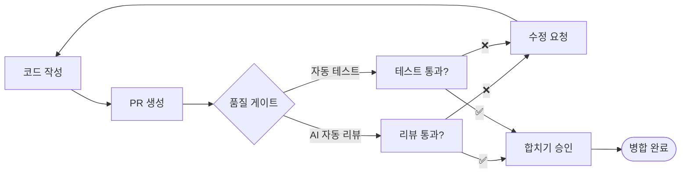
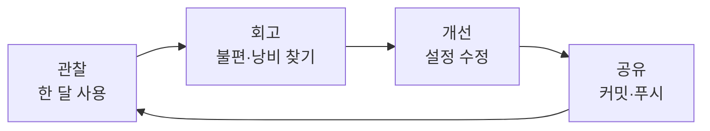

# 챕터 8: 팀과 함께, 그리고 더 멀리 — 협업·운영·확장 전략

## 여는 글

여기까지 왔습니다.

챕터 1에서 우리는 떨리는 손으로 `hello.txt` 파일 하나를 AI에게 만들어달라고 부탁했습니다. 챕터 4에서는 코드를 한 줄도 직접 쓰지 않고 동작하는 웹페이지를 만들었고, 챕터 5부터는 남이 만든 진짜 프로젝트에 뛰어들었습니다. 챕터 7에서는 마침내 여러 AI 에이전트가 사람의 지시 없이도 협력해 일하는 파이프라인을 직접 설계했습니다.

지금까지의 여정은 모두 **"나와 AI"** 의 이야기였습니다.

이번 챕터는 시야를 한 단계 넓힙니다. 주어가 "나"에서 **"우리"** 로 바뀝니다. 혼자 잘 쓰는 것을 넘어, 팀 전체가 같은 방식으로 AI와 협업하고, 비용과 보안을 프로답게 관리하며, 시간이 지나도 더 나아지는 체계를 만드는 법을 다룹니다.

이 챕터를 끝까지 읽고 나면, 여러분은 단순한 **Claude Code 사용자**가 아니라 **팀의 AI 협업 문화를 설계하는 사람**이 됩니다. 그리고 이 모든 것은 거창한 거버넌스 회의가 아니라, **"저장소에 무엇을 커밋하는가"** 라는 아주 구체적인 행위로 이루어집니다.

> **혼자 쓰는 분께:** 이 챕터는 "팀"을 전제로 쓰였지만, 1인 개발자에게도 그대로 유효합니다. "팀원"을 "6개월 뒤의 나" 또는 "새로 산 노트북"으로 바꿔 읽으면 됩니다. 미래의 나도 결국 협업 상대입니다.

---

## 8.0 챕터 5·6·7을 한 페이지로 — 건너뛴 분을 위한 다리

이 챕터는 책의 종착점이라, 앞선 심화 내용을 가볍게 활용합니다. 챕터 5·6·7을 아직 안 읽었거나 기억이 흐릿하다면, 아래 세 단락만 읽고 따라오셔도 충분합니다.

**챕터 5 — CLAUDE.md (프로젝트의 기억)**
프로젝트 루트에 `CLAUDE.md` 파일을 두면, Claude Code는 매번 그 내용을 자동으로 읽고 시작합니다. 코딩 규칙, 폴더 구조, 자주 쓰는 명령어 등을 적어두면 "이 프로젝트는 이렇게 일한다"를 AI가 영구적으로 기억합니다. 매번 같은 설명을 반복할 필요가 없어지는 것이죠.

**챕터 6 — 슬래시 명령과 MCP (반복의 묶음, 손발의 확장)**
자주 쓰는 작업 흐름은 `/명령어` 하나로 묶을 수 있습니다(`.claude/commands/` 폴더의 파일). MCP는 Claude Code에 외부 도구(브라우저, 문서, 데이터베이스 등)를 연결하는 표준 방식입니다. 둘 다 "한 번 설정하면 계속 쓰는" 자산입니다.

**챕터 7 — 서브에이전트와 훅 (역할 분담, 자동 트리거)**
서브에이전트는 역할별로 나눈 전문 AI 일꾼입니다(`.claude/agents/` 폴더). 훅(Hook)은 특정 시점(파일 저장, 작업 완료 등)에 자동으로 실행되는 동작입니다(`settings.json`에 정의). 사람이 매번 지시하지 않아도 일이 흐르게 만드는 장치들입니다.

여기서 한 가지 패턴이 보이시나요? **CLAUDE.md, 슬래시 명령, 스킬, 에이전트, 훅 — 이 모든 것은 결국 "파일"입니다.** 그리고 파일은 저장소에 커밋해 공유할 수 있습니다. 이번 챕터의 핵심이 바로 여기에 있습니다.

---

## 8.1 설정을 저장소에 — 팀이 같은 AI를 쓰는 법

### 왜 공유해야 하나요?

상상해봅시다. 여러분이 챕터 5~7을 거치며 멋진 `CLAUDE.md`와 유용한 슬래시 명령 `/리뷰`, 그리고 코드 리뷰 전문 서브에이전트를 만들었습니다. 그런데 옆자리 동료의 Claude Code는 이 중 아무것도 모릅니다. 같은 프로젝트인데도 여러분의 AI와 동료의 AI는 **완전히 다른 방식으로** 일합니다.

- 여러분의 AI는 프로젝트 규칙을 알고 일관된 스타일로 코드를 씁니다.
- 동료의 AI는 매번 처음 보는 프로젝트처럼 굴고, 스타일이 제각각입니다.

이건 마치 같은 회사인데 직원마다 다른 매뉴얼을 들고 일하는 것과 같습니다. 해결책은 단순합니다. **매뉴얼을 한 곳에 두고 모두가 같은 것을 본다.** 그 "한 곳"이 바로 git 저장소입니다.

*개인 설정 vs 팀 공유 설정 — 무엇이 달라지나*

| | 공유하기 전 | 공유한 후 |
|--|------------|----------|
| **프로젝트 규칙** | 각자 머릿속에 | `CLAUDE.md` 한 파일에 |
| **AI 결과물 스타일** | 사람마다 제각각 | 팀 전체가 일관됨 |
| **새 팀원 적응** | 며칠~몇 주 | `git clone` 즉시 |
| **노하우** | 개인 자산 | 팀 자산 |

### 무엇을 커밋하고, 무엇을 커밋하지 않나

`.claude/` 폴더 안의 파일들이 공유 대상입니다. 다만 **모든 것을 공유하지는 않습니다.** 개인 비밀(API 키 등)과 개인 취향은 빼야 합니다.

*`.claude/` 폴더의 공유 정책*

```
프로젝트루트/
├── CLAUDE.md                  ← ✅ 커밋 (팀 공통 규칙)
├── .claude/
│   ├── commands/              ← ✅ 커밋 (공유 슬래시 명령)
│   │   └── 리뷰.md
│   ├── agents/                ← ✅ 커밋 (공유 서브에이전트)
│   │   └── code-reviewer.md
│   ├── skills/                ← ✅ 커밋 (공유 스킬)
│   ├── settings.json          ← ✅ 커밋 (팀 공통 설정·권한)
│   └── settings.local.json    ← ❌ 커밋 안 함 (개인 설정·비밀)
└── .gitignore                 ← settings.local.json 제외 등록
```

핵심 규칙은 이것입니다:

- **`settings.json`** — 팀 전체가 공유할 설정. **커밋합니다.**
- **`settings.local.json`** — 나만의 개인 설정과 비밀. **커밋하지 않습니다.**

Claude Code는 이 두 파일을 자동으로 병합해서 사용하므로, 팀 공통 규칙은 지키면서 개인 취향도 따로 둘 수 있습니다.

> **비유하자면:** `settings.json`은 사무실 공용 게시판입니다. 모두가 보고 따릅니다. `settings.local.json`은 내 책상 서랍입니다. 내 물건은 거기 둡니다. 게시판에 내 비밀번호를 붙이지 않듯, 개인 비밀은 `local`에 둡니다.

`.gitignore`에는 다음 한 줄을 넣어 개인 설정이 실수로 커밋되는 것을 막습니다.

```
.claude/settings.local.json
```

---

### 실습 8-1: 팀 설정을 커밋하고, 동료가 받아보기

이 실습은 **두 사람의 관점**을 번갈아 봅니다. 혼자라면 폴더 두 개로 "보내는 나"와 "받는 동료"를 흉내 내며 따라 하세요.

**[보내는 사람] Step 1: 공유할 설정 확인**

프로젝트 루트에서 Claude Code에게 묻습니다.

```
지금 .claude 폴더에서 팀과 공유해야 할 파일과 공유하면 안 되는 파일을 구분해서 알려줘
```

```
● 공유 대상 (커밋 권장):
  - CLAUDE.md            : 프로젝트 코딩 규칙
  - .claude/commands/리뷰.md : 코드 리뷰 슬래시 명령
  - .claude/settings.json : 권한·훅 공통 설정

  공유 제외 (개인용):
  - .claude/settings.local.json : 개인 권한 허용 목록 (커밋 금지)

  .gitignore에 settings.local.json이 등록되어 있는지 확인이 필요합니다.
```

**[보내는 사람] Step 2: .gitignore 확인 후 커밋**

```
.gitignore에 .claude/settings.local.json이 빠져 있으면 추가하고,
공유 대상 설정 파일들을 "chore: 팀 공통 Claude Code 설정 추가" 메시지로 커밋해줘
```

```
● Edit(.gitignore)
  ⎿ + .claude/settings.local.json

● Bash(git add CLAUDE.md .claude/commands .claude/settings.json .gitignore)
● Bash(git commit -m "chore: 팀 공통 Claude Code 설정 추가")
  ⎿ [main a1b2c3d] chore: 팀 공통 Claude Code 설정 추가
     4 files changed, 87 insertions(+)

✓ 커밋 완료. git push로 원격에 올리면 팀원이 받을 수 있습니다.
```

`git push`로 원격 저장소에 올립니다.

**[받는 사람] Step 3: 동료가 설정을 받기**

이제 동료의 컴퓨터입니다. 동료는 그저 평소처럼 최신 코드를 받습니다.

```
git pull
```

```
Updating 9f8e7d6..a1b2c3d
Fast-forward
 CLAUDE.md                  | 32 ++++++++++++
 .claude/commands/리뷰.md    | 18 +++++++
 .claude/settings.json      | 37 +++++++++++++
 .gitignore                 |  1 +
 4 files changed, 88 insertions(+)
```

**[받는 사람] Step 4: 동작이 같은지 확인**

동료가 자기 Claude Code를 열고, 여러분이 만든 슬래시 명령을 그대로 호출해봅니다.

```
/리뷰
```

```
● 코드 리뷰를 시작합니다. (CLAUDE.md의 프로젝트 규칙 적용됨)
  변경된 파일 3개를 검토 중...
```

동료의 AI가 여러분과 **똑같이** 동작합니다. 같은 슬래시 명령, 같은 규칙, 같은 스타일. 설정 파일 하나가 git을 타고 흘러, 두 사람의 AI를 같은 일꾼으로 맞춘 것입니다.

> **이것이 핵심입니다.** 팀 표준화란 거창한 게 아닙니다. **"설정을 파일로 만들어 커밋한다"** — 딱 이 한 문장입니다.

스스로 해보기: 자신의 프로젝트에서 가장 유용한 슬래시 명령 하나를 골라 커밋해보세요. 그리고 동료(또는 다른 폴더에 clone한 사본)에서 `git pull` 후 그 명령이 그대로 작동하는지 확인해보세요.

---

### 변경 이력을 남기는 습관

설정도 코드처럼 진화합니다. 누가, 언제, 왜 규칙을 바꿨는지 기록이 없으면 나중에 "이 규칙 왜 있지?"라는 질문에 아무도 답하지 못합니다. `CLAUDE.md` 안에 작은 변경 이력 표를 두는 것을 권합니다.

```markdown
## 변경 이력
| 날짜 | 변경 내용 | 사유 |
|------|----------|------|
| 2026-06-10 | 커밋 메시지 규칙 추가 | 팀 컨벤션 통일 |
| 2026-06-14 | 테스트 필수 규칙 추가 | 회귀 버그 재발 방지 |
```

이 표 자체가 git 히스토리와 함께 팀의 의사결정 기록이 됩니다.

---

## 8.2 안전과 통제 — 위험은 막고, 신뢰는 키우기

AI에게 컴퓨터를 맡긴다는 것은 강력한 만큼 책임도 따릅니다. 하지만 겁먹을 필요는 없습니다. **프로의 자세란 위험을 무서워하는 게 아니라, 위험을 다루는 장치를 갖추는 것**입니다. 안전벨트를 매면 더 안심하고 운전하듯, 통제 장치가 있으면 AI에게 더 많은 일을 맡길 수 있습니다.

### 권한이라는 안전벨트

챕터 3에서 우리는 AI가 위험한 작업을 할 때 허락을 구하는 화면을 봤습니다. 팀 단위에서는 이 권한을 **미리, 명시적으로** 설정해 둡니다. `settings.json`에 무엇을 허용(allow)하고 무엇을 거부(deny)할지 적어두는 것이죠.

*권한 설정의 세 가지 동작*

| 키워드 | 의미 | 쓰임 |
|--------|------|------|
| `allow` | 묻지 않고 허용 | 안전하고 자주 쓰는 명령 |
| `ask` | 매번 물어봄 | 신중해야 할 작업 |
| `deny` | 아예 차단 | 절대 실행 금지할 위험 명령 |

가장 중요한 것은 `deny`입니다. **위험한 명령을 아예 실행조차 못 하게 막는 것**이 팀을 지키는 가장 확실한 방법입니다.

다음은 위험 명령을 차단하는 `settings.json` 예시입니다.

```json
{
  "permissions": {
    "allow": [
      "Bash(npm test)",
      "Bash(npm run lint)",
      "Read(./**)"
    ],
    "deny": [
      "Bash(rm -rf *)",
      "Bash(git push --force*)",
      "Read(./.env)",
      "Read(./**/*.key)"
    ]
  }
}
```

여기서 두 가지가 동시에 일어납니다. `npm test` 같은 안전한 명령은 묻지 않고 바로 실행되어 작업이 매끄럽고, `rm -rf`나 강제 푸시 같은 위험 명령은 원천 차단됩니다. 그리고 `.env`나 `.key` 파일은 **AI가 읽지조차 못합니다** — 민감정보 보호의 첫 단추입니다.

### 실습 8-2: 위험 명령 차단의 효과를 직접 확인하기

차단이 정말 효과가 있는지, **차단 전과 후를 대조**해서 눈으로 확인해봅시다.

**Step 1: 차단 설정 없이 — 위험 명령이 실행되어 버린다**

`deny` 설정이 없는 상태에서 (연습용 폴더에서만!) AI에게 위험한 요청을 합니다.

```
이 폴더의 임시 파일들을 rm -rf temp/ 로 싹 지워줘
```

```
● Bash(rm -rf temp/)
  ⎿ (출력 없음)

✓ temp/ 폴더를 삭제했습니다.
```

명령이 **그대로 실행되어** 폴더가 사라졌습니다. 만약 `temp/`가 아니라 더 중요한 경로였다면 아찔한 일입니다.

**Step 2: 차단 설정 추가**

```
settings.json의 deny 목록에 rm -rf 패턴을 추가해서
앞으로 이 명령이 실행되지 않도록 차단해줘
```

```
● Edit(.claude/settings.json)
  ⎿ "deny": [
  ⎿ +   "Bash(rm -rf *)"
  ⎿ ]

✓ rm -rf 차단 규칙을 추가했습니다.
```

**Step 3: 차단 설정 후 — 같은 명령이 거부된다**

이제 똑같은 위험 요청을 다시 해봅니다.

```
이 폴더의 임시 파일들을 rm -rf temp/ 로 싹 지워줘
```

```
● Bash(rm -rf temp/)
  ⎿ ✗ Permission denied: 이 명령은 settings.json의 deny 규칙에 의해
     차단되었습니다. (Bash(rm -rf *))

이 명령은 팀 정책상 차단되어 있습니다. 대신 안전하게 삭제할 파일을
먼저 목록으로 보여드릴까요?
```

같은 명령, 완전히 다른 결과입니다. **차단 전에는 실행되어 버렸고, 차단 후에는 거부됩니다.** 설정 한 줄이 사고를 막은 것입니다. 게다가 AI는 단순히 거부하는 데 그치지 않고 더 안전한 대안을 제안합니다.

이 `settings.json`을 8.1에서 배운 대로 커밋하면, **팀 전원이 이 안전벨트를 함께 맵니다.** 한 사람이 만든 안전 규칙이 팀 전체를 보호하는 것이죠.

스스로 해보기: 여러분의 프로젝트에서 "절대 AI가 건드리면 안 되는 것"을 세 가지 떠올려보세요(예: 운영 DB 접속 명령, 배포 스크립트, 비밀 키 파일). 그중 하나를 `deny` 규칙으로 추가하고, 차단되는지 확인해보세요.

---

### 민감정보 — 새어 나가지 않게

AI 협업에서 가장 신경 써야 할 위험은 **민감정보 유출**입니다. API 키, 비밀번호, 고객 데이터 같은 것들이죠. 세 겹의 방어선을 권합니다.

*민감정보를 지키는 세 겹의 방어선*

```
1겹: 읽기 차단     deny에 .env, *.key 등록 → AI가 파일을 못 읽음
        │
2겹: 커밋 차단     .gitignore에 비밀 파일 등록 → 저장소에 안 올라감
        │
3겹: 사람의 점검   PR 리뷰에서 비밀이 섞였는지 최종 확인
```

특히 1겹은 Claude Code 고유의 방어선입니다. `.env`를 `deny`에 넣어두면 AI가 그 파일을 **읽을 수조차 없으므로**, 실수로 비밀 키가 대화 맥락에 들어가 로그에 남을 일이 없습니다.

> **분명한 경고:** 실제 사고는 대부분 "설마 그럴까" 하는 방심에서 옵니다. AI에게 "이 에러 로그 분석해줘"라고 던졌는데 그 로그에 운영 DB 비밀번호가 통째로 들어 있던 사례, 설정 파일을 보여주다 액세스 토큰이 그대로 노출된 사례 — 모두 현실에서 일어납니다. 위 세 겹은 선택이 아니라 기본입니다.

---

## 8.3 비용과 사용량 — 프로답게 아끼는 습관

Claude Code는 토큰(token, AI가 읽고 쓰는 텍스트의 단위)을 소비하며 동작합니다. 요금제에는 사용량 한도가 있고요. 하지만 이걸 "아껴야 한다는 압박"으로 받아들이지 마세요. **효율적으로 일하는 습관**은 비용만 아끼는 게 아니라, AI의 응답을 더 빠르고 정확하게 만듭니다. 절약과 품질이 같은 방향을 가리키는 것이죠.

### 토큰을 낭비하는 방식 vs 아끼는 방식

핵심 원리는 단순합니다. **AI에게 필요한 만큼만 보여주고, 작업을 적당한 크기로 쪼개는 것.** 비효율적인 방식과 효율적인 방식을 정성적으로 비교해봅시다.

*같은 목표, 다른 작업량*

| 상황 | 비효율적 방식 | 효율적 방식 |
|------|--------------|------------|
| **특정 함수 수정** | "전체 코드 다 읽고 고쳐줘" → 프로젝트 전부를 맥락에 적재 | "@결제.js의 calculateTax 함수만 고쳐줘" → 필요한 파일만 |
| **긴 작업** | 한 세션에서 끝없이 이어감 → 맥락이 비대해지고 느려짐 | 단위가 끝날 때마다 `/clear`로 맥락 정리 |
| **반복 질문** | 매번 프로젝트 구조를 설명 | CLAUDE.md에 한 번 적어두고 자동 참조 |
| **탐색** | "버그 어디 있는지 다 뒤져봐" | "로그인 관련 파일에서 먼저 찾아봐" |

왼쪽 방식은 매번 책 한 권을 통째로 AI에게 읽히는 것과 같습니다. 오른쪽 방식은 필요한 페이지만 펼쳐 보여주는 것이죠. 결과물의 품질은 같거나 더 좋은데, 작업량은 몇 분의 일로 줄어듭니다.

### 효율을 만드는 네 가지 습관

1. **콕 집어 지칭하기** — `@파일명`으로 관련 파일만 명시하면 AI가 프로젝트 전체를 헤맬 필요가 없습니다.
2. **맥락 정리하기** — 한 작업이 끝나면 `/clear`로 대화 맥락을 비웁니다. 새 작업은 깨끗한 상태에서 시작하는 게 빠르고 정확합니다.
3. **CLAUDE.md 활용** — 반복 설명을 파일 한 번으로 대체합니다. 이것이 8.1과 8.3이 만나는 지점입니다 — 공유 설정이 곧 비용 절감입니다.
4. **작업 쪼개기** — 큰 작업을 작은 단위로 나눠 단계별로 진행하면, 각 단계의 맥락이 가볍게 유지됩니다.

### 실습 8-3: 사용량을 확인하고 작업 습관 점검하기

Claude Code에서 현재 세션의 맥락 상태를 확인할 수 있습니다.

```
/context
```

```
컨텍스트 사용 현황
──────────────────────────────
시스템 프롬프트     ▓▓ 4%
CLAUDE.md          ▓ 2%
대화 기록          ▓▓▓▓▓▓▓▓▓▓▓▓▓▓▓▓ 71%
여유 공간          ▓▓▓▓▓ 23%
──────────────────────────────
💡 대화 기록이 큽니다. 현재 작업이 끝났다면 /clear를 권합니다.
```

대화 기록이 맥락의 71%를 차지하고 있네요. 지금 작업이 일단락됐다면 `/clear`로 정리하는 게 좋습니다. 다음 작업은 가볍고 빠르게 시작됩니다.

> **습관이 곧 비용 관리입니다.** 사용량을 들여다보며 절약하려 애쓰는 것보다, 위 네 가지 습관을 몸에 익히는 편이 훨씬 효과적입니다. 잘 쪼개고, 콕 집고, 자주 비우세요. 그러면 비용은 알아서 따라옵니다.

스스로 해보기: 다음에 큰 작업을 할 때, 같은 작업을 두 가지 방식으로 시작해보세요. (1) "전체를 다 보고 처리해줘", (2) "@해당파일의 이 부분만 처리해줘". 두 경우 AI가 읽는 파일의 수와 응답 속도가 어떻게 다른지 체감해보세요.

---

## 8.4 품질 게이트 — 검토와 테스트를 흐름에 끼워 넣기

챕터 7에서 우리는 "코드 작성 → 자동 리뷰"가 흐르는 파이프라인을 만들었습니다. 이번엔 그 품질 장치를 **팀의 협업 흐름**, 즉 PR(Pull Request, 코드 변경을 팀에 제안하고 합치는 절차)에 끼워 넣습니다. 사람이 깜빡해도 품질 검사가 자동으로 작동하게 만드는 것이죠.

### 품질 게이트란?

품질 게이트(Quality Gate)는 **일정 기준을 통과해야만 다음 단계로 넘어가는 관문**입니다. 공항 보안 검색대를 떠올리면 됩니다. 모든 짐이 예외 없이 검색대를 통과해야 탑승구로 갈 수 있죠. 코드도 마찬가지로, 리뷰와 테스트라는 관문을 통과해야 합쳐집니다.

*품질 게이트가 있는 협업 흐름*



핵심은 **사람의 기억력에 의존하지 않는다**는 점입니다. "리뷰 깜빡했네", "테스트 안 돌렸네" 같은 실수가 구조적으로 차단됩니다.

### 두 단계로 쌓는 품질 게이트

품질 게이트는 두 위치에 둘 수 있습니다. 둘을 함께 쓰면 가장 강력합니다.

**1단계 — 내 컴퓨터에서 (커밋 전 훅)**
코드를 커밋하기 직전, 훅으로 리뷰·테스트를 자동 실행합니다. 문제를 PR을 올리기도 전에 잡습니다. 가장 빠르고 값싼 방어선입니다.

**2단계 — 저장소에서 (PR 자동 리뷰)**
PR이 올라오면, 자동으로 AI 리뷰가 댓글로 붙고 테스트가 돌아갑니다. 팀 전체가 같은 기준으로 검증받습니다.

### 실습 8-4: PR에 AI 자동 리뷰를 붙이기

PR이 생성될 때 Claude Code가 자동으로 코드를 리뷰하고 의견을 다는 흐름을 단계별로 구성해봅시다.

**Step 1: 리뷰 기준을 명령으로 정의**

먼저 "어떻게 리뷰할지"를 슬래시 명령으로 만들어 둡니다(`.claude/commands/pr리뷰.md`).

```
.claude/commands/pr리뷰.md 파일을 만들어줘.
변경된 코드를 보안·버그·가독성 세 관점에서 검토하고,
문제가 있으면 파일과 줄 번호를 짚어 구체적으로 지적하는 리뷰 명령으로.
```

```
● Write(.claude/commands/pr리뷰.md)
  ⎿ ---
    description: PR 변경분을 보안·버그·가독성 관점에서 리뷰
    ---
    현재 PR의 변경된 파일을 검토하세요.
    1. 보안: 민감정보 노출, 주입 취약점
    2. 버그: 경계 조건, 예외 처리 누락
    3. 가독성: 네이밍, 중복, 복잡도
    각 지적은 `파일:줄번호` 형식으로 위치를 명시하세요.

✓ PR 리뷰 명령을 생성했습니다.
```

**Step 2: PR 생성 시 자동 실행되도록 연결**

이 명령을 PR 시점에 자동 호출하도록 연결합니다. 협업 흐름에서 자동 리뷰가 붙는 모습은 이렇습니다.

```
team-repo에 새 PR이 올라옴
  → Claude Code가 /pr리뷰 자동 실행
  → 변경분 검토 후 리뷰 댓글 작성
```

**Step 3: 자동 리뷰 결과 확인**

PR에 다음과 같은 리뷰가 자동으로 달립니다.

```
🤖 Claude Code 자동 리뷰

[보안] payment.js:42
  사용자 입력 amount가 검증 없이 쿼리에 사용됩니다.
  음수·비숫자 입력 검증을 추가하세요.

[버그] payment.js:58
  결제 실패 시 catch 블록이 비어 있어 오류가 조용히 무시됩니다.
  최소한 로깅을 추가하세요.

[가독성] cart.js:15
  변수명 `d`가 모호합니다. `discountRate` 등으로 바꾸길 권합니다.

총 3건 (보안 1, 버그 1, 가독성 1). 보안 항목은 병합 전 수정을 권장합니다.
```

사람이 리뷰를 부탁하지 않아도, PR을 올린 순간 검토가 자동으로 따라붙습니다. 리뷰어는 이제 **AI가 1차로 걸러낸 것 위에서** 더 깊은 논의에 집중할 수 있습니다. AI가 사람을 대체하는 게 아니라, 사람을 더 높은 수준의 판단으로 끌어올리는 것이죠.

> **품질 게이트의 진짜 가치:** 실수를 잡는 것을 넘어, **팀의 품질 기준을 코드로 명문화**한다는 데 있습니다. "우리 팀은 빈 catch 블록을 허용하지 않는다"는 암묵적 규칙이 `pr리뷰.md`에 적히는 순간, 그것은 모두가 따르는 명시적 표준이 됩니다.

스스로 해보기: 여러분의 팀(또는 프로젝트)에서 "리뷰 때마다 반복해서 지적하는 것" 하나를 떠올려보세요. 그 기준을 `pr리뷰.md`에 한 줄 추가해, 다음부터는 AI가 자동으로 짚어주게 만들어보세요.

---

## 8.5 지속적 개선 — 하네스를 살아 움직이게

지금까지 만든 설정·명령·에이전트·권한·품질 게이트 — 이 모든 것을 합쳐 **하네스(harness)** 라고 부릅니다. AI가 효과적으로 일하도록 둘러싼 장치 전체를 뜻하죠. 그런데 좋은 하네스는 한 번 만들고 끝나는 게 아닙니다. **살아서 진화하는 것**입니다.

처음부터 완벽한 설정은 없습니다. 한 달을 써보면 "이건 너무 자주 묻네", "이 규칙은 오히려 방해되네", "이 작업은 명령으로 묶으면 좋겠다" 같은 깨달음이 쌓입니다. 이 깨달음을 설정에 반영하는 **운영 사이클**을 돌리는 것이 마지막 단계입니다.

*하네스 운영 사이클 — 한 달의 리듬*



이 사이클의 마지막 단계가 "공유(커밋·푸시)"라는 점에 주목하세요. **개선은 항상 저장소로 돌아옵니다.** 개인이 얻은 깨달음이 팀 전체의 자산이 되는 통로가 바로 git이니까요.

### 회고에서 무엇을 보나

한 달에 한 번, 30분이면 충분합니다. 다음 질문을 던져보세요.

- **자주 거부한 권한 요청이 있나?** → `ask`를 `deny`로, 또는 안전하다면 `allow`로 조정
- **매번 손으로 반복한 작업이 있나?** → 슬래시 명령이나 스킬로 묶기
- **AI가 자꾸 같은 실수를 하나?** → `CLAUDE.md`에 규칙으로 명시
- **방해만 되는 훅이나 규칙이 있나?** → 과감히 제거 (덜어내는 것도 개선입니다)

### 실습 8-5: 한 달 회고를 AI와 함께

놀랍게도, 하네스 회고조차 AI에게 맡길 수 있습니다.

```
지난 한 달간 이 프로젝트에서 내가 자주 거부하거나 반복한 작업 패턴을 분석하고,
CLAUDE.md나 슬래시 명령으로 개선할 만한 후보 3가지를 제안해줘
```

```
● 최근 작업 패턴을 분석했습니다.

1. [반복 작업] "커밋 전에 테스트 돌려줘"를 12번 요청
   → 제안: 커밋 전 훅으로 자동화하면 매번 요청 불필요

2. [반복 설명] "이 프로젝트는 한국어 주석을 쓴다"를 5번 반복
   → 제안: CLAUDE.md에 "주석은 한국어로 작성" 규칙 추가

3. [잦은 거부] "node_modules 안을 검색하려는 시도"를 8번 거부
   → 제안: settings.json에서 node_modules를 검색 제외로 설정

이 개선들을 적용할까요?
```

세 가지 모두 합리적인 제안입니다. 적용을 승인하면 AI가 직접 설정을 수정하고, 여러분은 그것을 커밋하기만 하면 됩니다. **사용 → 회고 → 개선 → 공유**의 한 바퀴가 완성되는 순간입니다.

> **이것이 "협업 문화 설계자"의 일입니다.** 도구를 쓰는 데서 멈추지 않고, 도구가 팀에 맞게 자라도록 가꾸는 것. 그 가꾸는 행위 하나하나가 또 저장소에 커밋으로 쌓입니다.

스스로 해보기: 지금 바로 작은 회고를 해보세요. 최근 일주일 동안 AI에게 똑같은 설명이나 부탁을 두 번 이상 반복한 적이 있나요? 있다면 그것을 `CLAUDE.md` 한 줄 또는 슬래시 명령 하나로 바꿔, 다시는 반복하지 않도록 만들어보세요.

---

## 이 책에서 여기까지 온 여러분에게

기억하시나요? 챕터 1의 그 순간을.

까만 터미널 화면 앞에서, `claude`라고 입력하고 떨리는 마음으로 Enter를 눌렀던 그 순간. "파일 하나 만들어줘"라는 말에 정말로 `hello.txt`가 생겨나던 그 작은 놀라움.

그때의 여러분과 지금의 여러분은 다른 사람입니다.

- 챕터 1·2·3에서 여러분은 **AI에게 말을 거는 법**을 배웠습니다. 명령어를 외우는 대신, 사람에게 부탁하듯 말하는 법을요.
- 챕터 4에서 여러분은 **처음으로 무언가를 만들었습니다.** 코드를 한 줄도 직접 쓰지 않고도요.
- 챕터 5·6에서 여러분은 **진짜 세계로 나갔습니다.** 남이 만든 거대한 코드를 다루고, 외부 도구를 연결하고, 자기만의 자동화를 구성했습니다.
- 챕터 7·8에서 여러분은 **설계자가 되었습니다.** AI 팀을 짜고, 자동으로 흐르는 파이프라인을 만들고, 그것을 팀 전체로 확장하는 사람이요.

처음에 여러분은 도구를 **배우는** 사람이었습니다. 이제 여러분은 도구를 **길들이고, 팀에 맞게 빚어내는** 사람입니다.

---

이 책은 여기서 끝나지만, 여러분의 여정은 끝나지 않습니다. 오히려 지금부터가 진짜 시작입니다. 이 책이 다루지 못한 길들이 여러분 앞에 열려 있습니다.

- **더 깊이:** 공식 문서(`claude.ai/code`의 문서)는 이 책보다 훨씬 빠르게 업데이트됩니다. 새 기능이 나오면 가장 먼저 그곳에 적힙니다.
- **더 넓게:** 여러분이 만든 멋진 슬래시 명령, 에이전트, 하네스를 동료와, 커뮤니티와 나누세요. 좋은 설정은 공유될 때 더 좋아집니다.
- **더 자신답게:** 이 책의 모든 예제는 출발점일 뿐입니다. 여러분의 일, 여러분의 팀, 여러분의 문제에 맞게 변형하세요. 가장 좋은 하네스는 여러분 자신이 만든 하네스입니다.

마지막으로 한 가지만 당부하고 싶습니다.

AI는 강력한 도구지만, **방향을 잡는 것은 언제나 사람입니다.** 무엇을 만들지, 무엇이 좋은 코드인지, 무엇이 우리 팀에 옳은 일인지 — 이 판단만큼은 AI에게 넘길 수 없습니다. 여러분이 이 책에서 배운 것은 결국 "AI를 잘 쓰는 법"이 아니라, **"AI와 함께 더 나은 결정을 내리는 사람이 되는 법"** 이었습니다.

`hello.txt`에서 시작해 팀의 협업 문화를 설계하는 데까지 온 여러분이라면, 그다음 무엇이든 만들어낼 수 있습니다.

이제, 여러분의 첫 진짜 프로젝트로 가보세요.

그곳에서 여러분이 만들어낼 것들이 기대됩니다.

---

> **마지막 스스로 해보기:** 이 책을 덮기 전에, 딱 하나만 해보세요. 지금 머릿속에 떠오르는 "이거 자동화하면 좋겠다" 싶은 일 하나를 Claude Code에게 말해보세요. 거창하지 않아도 됩니다. 작은 것 하나. 그것이 여러분의 다음 여정의 첫걸음입니다.
>
> 챕터 1에서 `hello.txt`로 시작했듯이, 다시 한번 작게 시작하세요. 그리고 이번엔, 어디까지 갈 수 있는지 여러분 스스로 알고 있습니다.
